# Validations and benchmarks

## DRAM

### DRAM: AIDA64 Extreme

#### Cache & Memory Benchmark

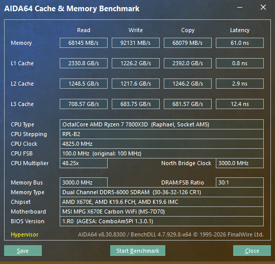

### DRAM: HYDRA

#### ANVIL (DRAM test)

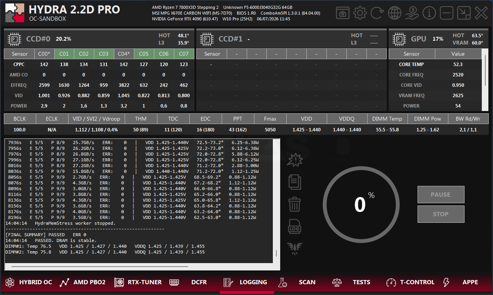

<!-- markdownlint-disable MD013 -->

```text
Creating a basic configuration file for settings...
ExecutePowercfgCommand failed (ExitCode=1): The power scheme, subgroup or setting specified does not exist.
***HYDRA 2.2D PRO (2204) by 1usmus***
Super Admin mode: Off
W10 Pro (25H2)    07/06/2026 11:45:56
AMD Ryzen 7 7800X3D Stepping 2    SVM: On    Unknown F5-6000J3040G32G 64GB
MSI MPG X670E CARBON WIFI (MS-7D70)    BIOS 1.R0    ComboAm5PI 1.3.0.1 (84.04.00)    TABLE 5505284
0  -  NVIDIA GeForce RTX 4090  (Active)    GeForce 610.47


ANVIL started...
-----------------------------------------------------------
MT/s 6000   FCLK 2133   PDM OFF   GDM ON-1T
Nitro RX Data 1   Nitro TX Data 2   Nitro Control Line 0
SOC VDDCR 1250   DRAM VDD 1430   DRAM VDDQ 1430   MC VDDIO 1430   CLDO VDDP 947

CL 30      RRDS 4     RDRDSCL 4      RDRDSC 1
RCD 36     RRDL 8     WRWRSCL 2      RDRDSD 6
RP 32      FAW 20     RTP 12         RDRDDD 6
RAS 126    WTRS 4     RDWR 16        WRWRSC 1
RC 60      WTRL 14    WRRD 4         WRWRSD 8
RFC 400    WR 48      REFI 32667     WRWRDD 8

ProcODT 48.0   ProcDqDs Hi-Z   DramDqDs 48.0   AddrCmdDs 30.0
RttNomWr RZQ/5   RttNomRd RZQ/5   RttWr RZQ/1   RttPark RZQ/3   RttParkDqs RZQ/4
-----------------------------------------------------------
Preset Detailed   Epoch 180s x5
WorkingSet 100%   Threads 8   ErrorSound Off   ErrorStop 1   OS Both
Patterns Evict Flood -> Rnd Fill Verify -> PFN Addr Mix -> Modulo Rand -> Modulo Sweep -> MI Byte Rot -> WalkBit Lane -> GBM Rotate -> Bit Fade
Address map active 63042d56e7b9
-----------------------------------------------------------
DRAM: Allocating 58752 MiB; available 59061 MiB; total 64901 MiB.
   20s   E 1/5   P 1/9   17.2GB/s   ERR:    0   |   VDD 1.425-1.440V   52.0-52.2°   5.88-6.12W
   40s   E 1/5   P 1/9   31.2GB/s   ERR:    0   |   VDD 1.425-1.425V   54.2-54.5°   6.12-6.12W
   60s   E 1/5   P 1/9   32.4GB/s   ERR:    0   |   VDD 1.425-1.440V   56.2-56.5°   6.12-6.12W
   81s   E 1/5   P 1/9   33.3GB/s   ERR:    0   |   VDD 1.425-1.440V   57.8-58.0°   6.25-6.38W
  101s   E 1/5   P 1/9   34.3GB/s   ERR:    0   |   VDD 1.425-1.425V   59.2-59.5°   3.62-5.12W
  121s   E 1/5   P 1/9   34.8GB/s   ERR:    0   |   VDD 1.425-1.425V   60.5-61.0°   6.25-6.38W
  142s   E 1/5   P 1/9   34.4GB/s   ERR:    0   |   VDD 1.425-1.425V   61.5-62.0°   6.38-6.38W
  162s   E 1/5   P 1/9   35.1GB/s   ERR:    0   |   VDD 1.425-1.425V   62.2-62.8°   6.12-6.38W
  182s   E 1/5   P 1/9   35.3GB/s   ERR:    0   |   VDD 1.425-1.425V   63.5-64.0°   5.88-6.12W
  202s   E 1/5   P 2/9   0.0GB/s   ERR:    0   |   VDD 1.425-1.425V   63.5-64.0°   4.38-4.50W
  222s   E 1/5   P 2/9   37.1GB/s   ERR:    0   |   VDD 1.425-1.425V   63.8-64.2°   5.50-5.62W
  242s   E 1/5   P 2/9   38.5GB/s   ERR:    0   |   VDD 1.425-1.425V   64.0-64.2°   4.50-4.88W
  262s   E 1/5   P 2/9   38.8GB/s   ERR:    0   |   VDD 1.425-1.425V   64.5-64.8°   4.75-5.25W
  282s   E 1/5   P 2/9   39.7GB/s   ERR:    0   |   VDD 1.425-1.425V   64.8-65.2°   5.50-5.62W
  302s   E 1/5   P 2/9   39.8GB/s   ERR:    0   |   VDD 1.425-1.440V   65.0-65.5°   4.75-4.75W
  322s   E 1/5   P 2/9   40.3GB/s   ERR:    0   |   VDD 1.425-1.425V   65.5-66.0°   4.75-4.75W
  343s   E 1/5   P 2/9   40.4GB/s   ERR:    0   |   VDD 1.425-1.425V   66.0-66.5°   5.25-5.62W
  363s   E 1/5   P 2/9   40.3GB/s   ERR:    0   |   VDD 1.425-1.425V   66.0-66.5°   4.88-5.25W
  383s   E 1/5   P 3/9   0.0GB/s   ERR:    0   |   VDD 1.425-1.425V   66.0-66.5°   3.12-3.12W
  403s   E 1/5   P 3/9   16.6GB/s   ERR:    0   |   VDD 1.425-1.425V   65.0-65.5°   3.12-3.75W
  423s   E 1/5   P 3/9   18.8GB/s   ERR:    0   |   VDD 1.425-1.440V   64.2-64.8°   3.25-3.62W
  443s   E 1/5   P 3/9   18.7GB/s   ERR:    0   |   VDD 1.425-1.425V   64.0-64.2°   3.12-3.12W
  463s   E 1/5   P 3/9   18.8GB/s   ERR:    0   |   VDD 1.425-1.440V   63.8-64.0°   2.88-4.12W
  483s   E 1/5   P 3/9   18.7GB/s   ERR:    0   |   VDD 1.425-1.425V   63.5-63.8°   2.75-3.00W
  503s   E 1/5   P 3/9   19.3GB/s   ERR:    0   |   VDD 1.425-1.425V   63.2-63.8°   3.12-3.25W
  523s   E 1/5   P 3/9   19.3GB/s   ERR:    0   |   VDD 1.425-1.425V   63.0-63.5°   3.12-3.25W
  543s   E 1/5   P 3/9   19.2GB/s   ERR:    0   |   VDD 1.425-1.425V   63.0-63.2°   3.12-3.12W
  563s   E 1/5   P 4/9   0.0GB/s   ERR:    0   |   VDD 1.425-1.440V   63.0-63.5°   6.50-6.50W
  583s   E 1/5   P 4/9   19.7GB/s   ERR:    0   |   VDD 1.425-1.425V   64.5-65.0°   5.00-5.50W
  603s   E 1/5   P 4/9   20.2GB/s   ERR:    0   |   VDD 1.425-1.425V   65.8-66.2°   5.25-5.62W
  623s   E 1/5   P 4/9   21.4GB/s   ERR:    0   |   VDD 1.425-1.425V   66.5-67.0°   6.25-6.25W
  643s   E 1/5   P 4/9   21.5GB/s   ERR:    0   |   VDD 1.425-1.425V   67.0-67.5°   6.25-6.25W
  663s   E 1/5   P 4/9   21.5GB/s   ERR:    0   |   VDD 1.425-1.425V   67.8-68.2°   3.50-3.75W
  683s   E 1/5   P 4/9   21.4GB/s   ERR:    0   |   VDD 1.425-1.440V   68.0-68.5°   5.25-5.62W
  703s   E 1/5   P 4/9   21.5GB/s   ERR:    0   |   VDD 1.425-1.425V   68.5-69.0°   6.12-6.38W
  723s   E 1/5   P 4/9   21.7GB/s   ERR:    0   |   VDD 1.425-1.425V   69.0-69.5°   6.38-6.38W
  744s   E 1/5   P 5/9   0.0GB/s   ERR:    0   |   VDD 1.425-1.440V   69.2-69.8°   5.12-5.88W
  764s   E 1/5   P 5/9   18.2GB/s   ERR:    0   |   VDD 1.425-1.425V   69.5-70.0°   5.25-5.88W
  784s   E 1/5   P 5/9   19.8GB/s   ERR:    0   |   VDD 1.425-1.425V   70.0-70.2°   5.88-6.75W
  804s   E 1/5   P 5/9   20.6GB/s   ERR:    0   |   VDD 1.425-1.440V   70.2-70.5°   6.12-6.25W
  824s   E 1/5   P 5/9   21.7GB/s   ERR:    0   |   VDD 1.425-1.425V   70.5-71.0°   6.25-6.25W
  844s   E 1/5   P 5/9   22.4GB/s   ERR:    0   |   VDD 1.425-1.440V   70.5-70.8°   4.50-4.50W
  864s   E 1/5   P 5/9   23.1GB/s   ERR:    0   |   VDD 1.425-1.425V   70.5-71.0°   6.38-6.50W
  884s   E 1/5   P 5/9   23.7GB/s   ERR:    0   |   VDD 1.425-1.425V   70.8-71.2°   4.88-5.75W
  904s   E 1/5   P 5/9   24.1GB/s   ERR:    0   |   VDD 1.425-1.425V   71.0-71.5°   4.50-4.75W
  924s   E 1/5   P 6/9   0.0GB/s   ERR:    0   |   VDD 1.425-1.425V   71.0-71.5°   4.75-4.88W
  944s   E 1/5   P 6/9   36.0GB/s   ERR:    0   |   VDD 1.425-1.425V   70.8-71.0°   4.25-4.62W
  964s   E 1/5   P 6/9   39.1GB/s   ERR:    0   |   VDD 1.425-1.425V   70.5-71.0°   4.50-4.50W
  984s   E 1/5   P 6/9   40.0GB/s   ERR:    0   |   VDD 1.425-1.440V   70.5-71.0°   5.00-5.38W
 1004s   E 1/5   P 6/9   39.8GB/s   ERR:    0   |   VDD 1.425-1.440V   70.5-71.0°   4.50-4.88W
 1024s   E 1/5   P 6/9   40.1GB/s   ERR:    0   |   VDD 1.425-1.425V   70.5-71.0°   4.75-4.88W
 1044s   E 1/5   P 6/9   40.6GB/s   ERR:    0   |   VDD 1.425-1.425V   70.5-71.0°   4.88-5.00W
 1064s   E 1/5   P 6/9   40.4GB/s   ERR:    0   |   VDD 1.425-1.425V   70.5-71.0°   4.50-5.00W
 1084s   E 1/5   P 6/9   40.6GB/s   ERR:    0   |   VDD 1.425-1.425V   70.5-71.0°   4.50-4.50W
 1104s   E 1/5   P 7/9   26.4GB/s   ERR:    0   |   VDD 1.425-1.425V   70.8-71.2°   6.12-6.38W
 1124s   E 1/5   P 7/9   53.8GB/s   ERR:    0   |   VDD 1.425-1.425V   72.0-72.5°   6.00-6.12W
 1144s   E 1/5   P 7/9   54.6GB/s   ERR:    0   |   VDD 1.425-1.425V   72.8-73.0°   5.88-6.12W
 1164s   E 1/5   P 7/9   55.3GB/s   ERR:    0   |   VDD 1.425-1.425V   73.2-73.5°   6.38-6.50W
 1184s   E 1/5   P 7/9   55.8GB/s   ERR:    0   |   VDD 1.425-1.425V   73.5-74.0°   6.12-6.25W
 1204s   E 1/5   P 7/9   55.9GB/s   ERR:    0   |   VDD 1.425-1.425V   74.0-74.2°   6.12-6.38W
 1224s   E 1/5   P 7/9   56.1GB/s   ERR:    0   |   VDD 1.425-1.440V   74.2-74.5°   6.12-6.38W
 1244s   E 1/5   P 7/9   56.3GB/s   ERR:    0   |   VDD 1.425-1.425V   74.5-75.0°   6.12-6.25W
 1264s   E 1/5   P 7/9   56.2GB/s   ERR:    0   |   VDD 1.425-1.425V   74.8-75.2°   6.12-6.12W
 1284s   E 1/5   P 8/9   0.0GB/s   ERR:    0   |   VDD 1.425-1.425V   74.8-75.0°   4.12-4.50W
 1304s   E 1/5   P 8/9   22.0GB/s   ERR:    0   |   VDD 1.425-1.425V   73.2-73.5°   6.25-6.50W
 1324s   E 1/5   P 8/9   22.9GB/s   ERR:    0   |   VDD 1.425-1.425V   72.5-72.8°   3.88-4.00W
 1344s   E 1/5   P 8/9   24.9GB/s   ERR:    0   |   VDD 1.425-1.425V   72.2-72.8°   2.62-2.88W
 1364s   E 1/5   P 8/9   26.1GB/s   ERR:    0   |   VDD 1.425-1.425V   72.2-72.8°   2.88-3.12W
 1384s   E 1/5   P 8/9   26.6GB/s   ERR:    0   |   VDD 1.425-1.440V   72.0-72.5°   2.88-3.25W
 1404s   E 1/5   P 8/9   26.9GB/s   ERR:    0   |   VDD 1.425-1.425V   71.8-72.0°   3.25-3.50W
 1424s   E 1/5   P 8/9   27.4GB/s   ERR:    0   |   VDD 1.425-1.425V   71.5-72.0°   3.62-3.75W
 1444s   E 1/5   P 8/9   27.6GB/s   ERR:    0   |   VDD 1.425-1.425V   71.5-71.8°   2.62-3.25W
 1464s   E 1/5   P 8/9   27.7GB/s   ERR:    0   |   VDD 1.425-1.440V   71.2-71.8°   6.75-6.88W
 1484s   E 1/5   P 9/9   3.1GB/s   ERR:    0   |   VDD 1.425-1.425V   68.8-69.2°   0.88-1.25W
 1504s   E 1/5   P 9/9   4.6GB/s   ERR:    0   |   VDD 1.425-1.425V   67.8-68.0°   0.88-1.12W
 1524s   E 1/5   P 9/9   3.1GB/s   ERR:    0   |   VDD 1.425-1.440V   66.2-66.5°   0.88-1.12W
 1544s   E 1/5   P 9/9   3.8GB/s   ERR:    0   |   VDD 1.425-1.440V   65.5-65.8°   1.12-1.12W
 1565s   E 1/5   P 9/9   3.7GB/s   ERR:    0   |   VDD 1.425-1.425V   65.0-65.5°   1.00-1.12W
 1585s   E 1/5   P 9/9   3.6GB/s   ERR:    0   |   VDD 1.425-1.440V   63.8-64.2°   0.88-1.12W
 1605s   E 1/5   P 9/9   3.9GB/s   ERR:    0   |   VDD 1.425-1.440V   63.5-63.8°   0.88-1.12W
 1625s   E 1/5   P 9/9   3.4GB/s   ERR:    0   |   VDD 1.425-1.440V   62.5-62.8°   0.88-1.12W
12:14:44   HydraMemStress worker stopped.
DRAM: Allocating 60032 MiB; available 60320 MiB; total 64901 MiB.
 1649s   E 2/5   P 1/9   0.0GB/s   ERR:    0   |   VDD 1.425-1.425V   62.2-62.5°   3.75-3.88W
 1669s   E 2/5   P 1/9   28.4GB/s   ERR:    0   |   VDD 1.425-1.440V   64.2-64.5°   3.75-5.88W
 1689s   E 2/5   P 1/9   33.6GB/s   ERR:    0   |   VDD 1.440-1.440V   66.0-66.5°   5.62-5.62W
 1710s   E 2/5   P 1/9   30.8GB/s   ERR:    0   |   VDD 1.425-1.425V   67.2-67.8°   6.12-6.50W
 1730s   E 2/5   P 1/9   33.1GB/s   ERR:    0   |   VDD 1.425-1.440V   68.0-68.5°   6.12-6.38W
 1750s   E 2/5   P 1/9   34.0GB/s   ERR:    0   |   VDD 1.425-1.425V   68.8-69.2°   6.12-6.50W
 1770s   E 2/5   P 1/9   34.6GB/s   ERR:    0   |   VDD 1.425-1.425V   69.5-70.2°   5.75-6.12W
 1790s   E 2/5   P 1/9   35.3GB/s   ERR:    0   |   VDD 1.425-1.425V   70.2-70.5°   5.62-5.62W
 1810s   E 2/5   P 1/9   34.9GB/s   ERR:    0   |   VDD 1.425-1.425V   70.5-70.8°   6.12-6.12W
 1830s   E 2/5   P 1/9   35.2GB/s   ERR:    0   |   VDD 1.425-1.425V   71.2-71.5°   6.50-6.75W
 1850s   E 2/5   P 2/9   33.2GB/s   ERR:    0   |   VDD 1.425-1.425V   70.8-71.2°   4.75-4.88W
 1870s   E 2/5   P 2/9   38.5GB/s   ERR:    0   |   VDD 1.425-1.440V   70.8-71.0°   3.50-3.62W
 1890s   E 2/5   P 2/9   38.6GB/s   ERR:    0   |   VDD 1.425-1.425V   70.5-71.0°   5.62-5.62W
 1910s   E 2/5   P 2/9   39.6GB/s   ERR:    0   |   VDD 1.425-1.425V   70.8-71.0°   4.50-4.75W
 1930s   E 2/5   P 2/9   40.0GB/s   ERR:    0   |   VDD 1.425-1.425V   71.0-71.2°   4.75-5.25W
 1950s   E 2/5   P 2/9   40.0GB/s   ERR:    0   |   VDD 1.425-1.425V   71.0-71.5°   5.38-5.62W
 1970s   E 2/5   P 2/9   40.2GB/s   ERR:    0   |   VDD 1.425-1.425V   71.0-71.5°   4.50-4.75W
 1990s   E 2/5   P 2/9   40.3GB/s   ERR:    0   |   VDD 1.425-1.425V   71.2-71.8°   4.75-4.88W
 2010s   E 2/5   P 2/9   40.4GB/s   ERR:    0   |   VDD 1.425-1.425V   71.2-71.8°   5.50-5.62W
 2030s   E 2/5   P 3/9   6.9GB/s   ERR:    0   |   VDD 1.425-1.425V   70.5-70.8°   2.88-3.25W
 2050s   E 2/5   P 3/9   17.2GB/s   ERR:    0   |   VDD 1.425-1.425V   69.2-69.8°   2.88-3.12W
 2070s   E 2/5   P 3/9   19.0GB/s   ERR:    0   |   VDD 1.425-1.425V   68.5-69.0°   3.12-3.12W
 2090s   E 2/5   P 3/9   18.3GB/s   ERR:    0   |   VDD 1.425-1.425V   68.0-68.5°   3.12-3.25W
 2110s   E 2/5   P 3/9   18.4GB/s   ERR:    0   |   VDD 1.425-1.425V   67.8-68.0°   3.12-3.25W
 2130s   E 2/5   P 3/9   19.2GB/s   ERR:    0   |   VDD 1.425-1.425V   67.2-67.8°   3.50-4.12W
 2150s   E 2/5   P 3/9   19.2GB/s   ERR:    0   |   VDD 1.425-1.425V   67.0-67.2°   3.12-3.12W
 2170s   E 2/5   P 3/9   19.0GB/s   ERR:    0   |   VDD 1.425-1.425V   66.8-67.0°   3.12-3.25W
 2190s   E 2/5   P 3/9   19.0GB/s   ERR:    0   |   VDD 1.425-1.440V   66.2-66.8°   3.12-3.12W
 2210s   E 2/5   P 4/9   21.0GB/s   ERR:    0   |   VDD 1.425-1.425V   67.2-67.8°   6.25-6.50W
 2230s   E 2/5   P 4/9   19.4GB/s   ERR:    0   |   VDD 1.425-1.425V   68.2-68.8°   6.12-6.25W
 2250s   E 2/5   P 4/9   21.1GB/s   ERR:    0   |   VDD 1.425-1.425V   69.2-69.8°   6.12-6.38W
 2270s   E 2/5   P 4/9   21.0GB/s   ERR:    0   |   VDD 1.425-1.440V   69.8-70.2°   5.88-6.25W
 2290s   E 2/5   P 4/9   21.4GB/s   ERR:    0   |   VDD 1.425-1.425V   70.2-70.8°   6.25-6.25W
 2310s   E 2/5   P 4/9   21.5GB/s   ERR:    0   |   VDD 1.425-1.425V   70.8-71.2°   5.62-5.88W
 2330s   E 2/5   P 4/9   21.6GB/s   ERR:    0   |   VDD 1.425-1.425V   71.2-71.5°   3.25-3.88W
 2350s   E 2/5   P 4/9   21.6GB/s   ERR:    0   |   VDD 1.425-1.440V   71.5-72.0°   5.62-5.62W
 2370s   E 2/5   P 4/9   21.5GB/s   ERR:    0   |   VDD 1.425-1.425V   71.8-72.2°   5.38-5.50W
 2390s   E 2/5   P 5/9   20.5GB/s   ERR:    0   |   VDD 1.425-1.425V   71.8-72.5°   6.12-6.12W
 2410s   E 2/5   P 5/9   19.2GB/s   ERR:    0   |   VDD 1.425-1.425V   72.0-72.5°   5.12-6.50W
 2430s   E 2/5   P 5/9   20.3GB/s   ERR:    0   |   VDD 1.425-1.440V   72.5-72.8°   6.12-6.50W
 2450s   E 2/5   P 5/9   20.9GB/s   ERR:    0   |   VDD 1.425-1.425V   72.5-73.0°   5.88-6.50W
 2470s   E 2/5   P 5/9   22.0GB/s   ERR:    0   |   VDD 1.425-1.425V   72.8-73.2°   5.50-6.50W
 2490s   E 2/5   P 5/9   22.5GB/s   ERR:    0   |   VDD 1.425-1.440V   73.0-73.2°   5.12-5.88W
 2510s   E 2/5   P 5/9   23.3GB/s   ERR:    0   |   VDD 1.425-1.440V   72.8-73.2°   6.12-6.75W
 2530s   E 2/5   P 5/9   23.9GB/s   ERR:    0   |   VDD 1.425-1.425V   73.0-73.5°   4.12-5.25W
 2550s   E 2/5   P 5/9   24.3GB/s   ERR:    0   |   VDD 1.425-1.425V   73.2-73.5°   6.38-6.38W
 2570s   E 2/5   P 6/9   26.7GB/s   ERR:    0   |   VDD 1.425-1.425V   72.8-73.2°   4.88-5.12W
 2590s   E 2/5   P 6/9   36.9GB/s   ERR:    0   |   VDD 1.425-1.425V   72.5-73.0°   4.50-5.00W
 2610s   E 2/5   P 6/9   39.7GB/s   ERR:    0   |   VDD 1.425-1.425V   72.5-73.0°   4.75-5.00W
 2630s   E 2/5   P 6/9   39.9GB/s   ERR:    0   |   VDD 1.425-1.425V   72.2-72.8°   4.50-4.50W
 2650s   E 2/5   P 6/9   40.1GB/s   ERR:    0   |   VDD 1.425-1.440V   72.2-72.8°   4.75-4.75W
 2670s   E 2/5   P 6/9   40.6GB/s   ERR:    0   |   VDD 1.425-1.425V   72.2-72.8°   4.88-5.00W
 2690s   E 2/5   P 6/9   40.5GB/s   ERR:    0   |   VDD 1.425-1.425V   72.0-72.8°   4.50-4.50W
 2710s   E 2/5   P 6/9   40.7GB/s   ERR:    0   |   VDD 1.425-1.425V   72.0-72.5°   4.75-4.88W
 2730s   E 2/5   P 6/9   40.8GB/s   ERR:    0   |   VDD 1.425-1.425V   71.8-72.5°   4.50-4.75W
 2750s   E 2/5   P 7/9   46.4GB/s   ERR:    0   |   VDD 1.425-1.425V   72.5-73.2°   6.12-6.50W
 2770s   E 2/5   P 7/9   54.4GB/s   ERR:    0   |   VDD 1.425-1.440V   73.2-74.0°   5.88-6.25W
 2790s   E 2/5   P 7/9   54.6GB/s   ERR:    0   |   VDD 1.425-1.440V   73.8-74.5°   6.12-6.12W
 2810s   E 2/5   P 7/9   55.5GB/s   ERR:    0   |   VDD 1.425-1.425V   74.2-75.0°   6.12-6.88W
 2830s   E 2/5   P 7/9   55.8GB/s   ERR:    0   |   VDD 1.425-1.425V   74.5-75.2°   5.88-6.12W
 2850s   E 2/5   P 7/9   56.1GB/s   ERR:    0   |   VDD 1.425-1.440V   74.8-75.5°   6.12-6.25W
 2870s   E 2/5   P 7/9   56.3GB/s   ERR:    0   |   VDD 1.425-1.440V   75.0-75.8°   5.88-6.12W
 2890s   E 2/5   P 7/9   56.2GB/s   ERR:    0   |   VDD 1.425-1.425V   75.0-76.0°   6.12-6.12W
 2910s   E 2/5   P 7/9   56.3GB/s   ERR:    0   |   VDD 1.425-1.425V   75.2-76.0°   6.12-6.38W
 2930s   E 2/5   P 8/9   18.4GB/s   ERR:    0   |   VDD 1.425-1.425V   74.2-75.0°   6.12-6.38W
 2950s   E 2/5   P 8/9   22.9GB/s   ERR:    0   |   VDD 1.425-1.425V   73.0-73.8°   3.75-3.88W
 2970s   E 2/5   P 8/9   24.2GB/s   ERR:    0   |   VDD 1.425-1.425V   73.0-73.8°   6.25-6.50W
 2990s   E 2/5   P 8/9   24.6GB/s   ERR:    0   |   VDD 1.425-1.425V   72.2-73.0°   3.38-3.50W
 3010s   E 2/5   P 8/9   25.6GB/s   ERR:    0   |   VDD 1.425-1.425V   72.0-72.8°   2.88-3.25W
 3030s   E 2/5   P 8/9   26.5GB/s   ERR:    0   |   VDD 1.425-1.425V   72.0-72.8°   3.25-3.25W
 3050s   E 2/5   P 8/9   26.7GB/s   ERR:    0   |   VDD 1.425-1.425V   71.5-72.5°   3.12-3.25W
 3070s   E 2/5   P 8/9   27.0GB/s   ERR:    0   |   VDD 1.425-1.425V   71.5-72.2°   3.12-3.25W
 3090s   E 2/5   P 8/9   27.4GB/s   ERR:    0   |   VDD 1.425-1.425V   71.5-72.2°   3.25-3.50W
 3110s   E 2/5   P 9/9   8.9GB/s   ERR:    0   |   VDD 1.425-1.425V   70.2-71.0°   1.12-1.12W
 3130s   E 2/5   P 9/9   2.3GB/s   ERR:    0   |   VDD 1.425-1.440V   68.0-68.8°   1.12-1.12W
 3150s   E 2/5   P 9/9   4.1GB/s   ERR:    0   |   VDD 1.425-1.440V   67.0-67.8°   0.88-1.12W
 3170s   E 2/5   P 9/9   2.8GB/s   ERR:    0   |   VDD 1.425-1.440V   66.0-66.5°   4.75-4.88W
 3190s   E 2/5   P 9/9   3.6GB/s   ERR:    0   |   VDD 1.425-1.440V   65.0-65.8°   1.12-1.50W
 3210s   E 2/5   P 9/9   4.1GB/s   ERR:    0   |   VDD 1.425-1.440V   64.5-65.0°   1.12-1.12W
 3230s   E 2/5   P 9/9   3.5GB/s   ERR:    0   |   VDD 1.425-1.440V   63.5-64.0°   0.88-0.88W
 3250s   E 2/5   P 9/9   3.9GB/s   ERR:    0   |   VDD 1.425-1.425V   63.0-63.5°   0.88-1.12W
 3270s   E 2/5   P 9/9   3.8GB/s   ERR:    0   |   VDD 1.425-1.440V   62.5-63.0°   4.25-4.75W
12:42:04   HydraMemStress worker stopped.
DRAM: Allocating 60800 MiB; available 61118 MiB; total 64901 MiB.
 3290s   E 3/5   P 1/9   0.0GB/s   ERR:    0   |   VDD 1.425-1.425V   62.2-62.8°   3.38-3.75W
 3310s   E 3/5   P 1/9   32.2GB/s   ERR:    0   |   VDD 1.425-1.425V   64.2-64.8°   6.12-6.12W
 3330s   E 3/5   P 1/9   33.0GB/s   ERR:    0   |   VDD 1.425-1.425V   66.0-66.5°   5.62-5.75W
 3351s   E 3/5   P 1/9   31.1GB/s   ERR:    0   |   VDD 1.425-1.425V   67.2-67.8°   6.25-6.50W
 3371s   E 3/5   P 1/9   33.0GB/s   ERR:    0   |   VDD 1.425-1.425V   68.2-68.8°   5.88-6.25W
 3391s   E 3/5   P 1/9   33.5GB/s   ERR:    0   |   VDD 1.425-1.425V   68.8-69.2°   6.12-6.50W
 3411s   E 3/5   P 1/9   34.3GB/s   ERR:    0   |   VDD 1.425-1.425V   69.5-70.0°   3.62-3.75W
 3431s   E 3/5   P 1/9   33.4GB/s   ERR:    0   |   VDD 1.425-1.425V   70.0-70.5°   6.25-6.50W
 3451s   E 3/5   P 1/9   34.0GB/s   ERR:    0   |   VDD 1.425-1.425V   70.5-71.0°   6.25-6.50W
 3471s   E 3/5   P 1/9   34.5GB/s   ERR:    0   |   VDD 1.425-1.425V   71.0-71.5°   6.00-6.12W
 3491s   E 3/5   P 2/9   31.6GB/s   ERR:    0   |   VDD 1.425-1.440V   70.8-71.0°   4.75-4.75W
 3511s   E 3/5   P 2/9   38.3GB/s   ERR:    0   |   VDD 1.425-1.440V   70.8-71.2°   5.38-5.50W
 3531s   E 3/5   P 2/9   38.2GB/s   ERR:    0   |   VDD 1.425-1.425V   70.5-71.0°   4.75-4.75W
 3551s   E 3/5   P 2/9   39.4GB/s   ERR:    0   |   VDD 1.425-1.425V   70.8-71.2°   4.75-4.88W
 3571s   E 3/5   P 2/9   39.5GB/s   ERR:    0   |   VDD 1.425-1.425V   71.0-71.5°   5.25-5.62W
 3591s   E 3/5   P 2/9   39.5GB/s   ERR:    0   |   VDD 1.425-1.425V   70.8-71.2°   4.75-4.75W
 3611s   E 3/5   P 2/9   39.9GB/s   ERR:    0   |   VDD 1.425-1.425V   71.0-71.5°   4.50-4.88W
 3631s   E 3/5   P 2/9   40.0GB/s   ERR:    0   |   VDD 1.425-1.425V   71.2-72.0°   5.62-5.75W
 3651s   E 3/5   P 2/9   39.9GB/s   ERR:    0   |   VDD 1.425-1.440V   71.2-71.8°   4.88-5.00W
 3671s   E 3/5   P 3/9   10.5GB/s   ERR:    0   |   VDD 1.425-1.440V   70.8-71.2°   3.12-3.12W
 3691s   E 3/5   P 3/9   14.5GB/s   ERR:    0   |   VDD 1.425-1.440V   69.5-70.0°   3.12-3.12W
 3711s   E 3/5   P 3/9   17.8GB/s   ERR:    0   |   VDD 1.425-1.425V   68.8-69.2°   2.62-3.12W
 3731s   E 3/5   P 3/9   19.1GB/s   ERR:    0   |   VDD 1.425-1.425V   68.2-68.8°   2.88-3.12W
 3751s   E 3/5   P 3/9   18.5GB/s   ERR:    0   |   VDD 1.425-1.425V   68.0-68.2°   3.25-3.25W
 3771s   E 3/5   P 3/9   18.6GB/s   ERR:    0   |   VDD 1.425-1.425V   67.5-68.0°   2.88-3.12W
 3791s   E 3/5   P 3/9   19.1GB/s   ERR:    0   |   VDD 1.425-1.425V   67.2-67.5°   3.12-3.12W
 3811s   E 3/5   P 3/9   19.3GB/s   ERR:    0   |   VDD 1.425-1.425V   66.8-67.2°   3.12-3.12W
 3832s   E 3/5   P 3/9   19.2GB/s   ERR:    0   |   VDD 1.425-1.425V   66.5-67.0°   3.12-3.12W
 3852s   E 3/5   P 4/9   17.8GB/s   ERR:    0   |   VDD 1.425-1.440V   67.2-67.5°   5.25-5.25W
 3872s   E 3/5   P 4/9   19.8GB/s   ERR:    0   |   VDD 1.425-1.425V   68.5-69.0°   5.50-5.75W
 3892s   E 3/5   P 4/9   20.5GB/s   ERR:    0   |   VDD 1.425-1.425V   69.2-70.0°   5.25-5.25W
 3912s   E 3/5   P 4/9   21.1GB/s   ERR:    0   |   VDD 1.425-1.440V   70.0-70.5°   4.88-5.62W
 3932s   E 3/5   P 4/9   21.1GB/s   ERR:    0   |   VDD 1.425-1.425V   70.5-71.0°   5.25-5.50W
 3952s   E 3/5   P 4/9   21.3GB/s   ERR:    0   |   VDD 1.425-1.440V   70.8-71.5°   5.88-6.38W
 3972s   E 3/5   P 4/9   21.4GB/s   ERR:    0   |   VDD 1.425-1.440V   71.2-71.8°   5.25-5.25W
 3992s   E 3/5   P 4/9   21.4GB/s   ERR:    0   |   VDD 1.425-1.425V   71.5-72.0°   5.25-5.25W
 4012s   E 3/5   P 4/9   21.5GB/s   ERR:    0   |   VDD 1.425-1.425V   72.0-72.2°   5.38-6.00W
 4032s   E 3/5   P 5/9   17.3GB/s   ERR:    0   |   VDD 1.425-1.425V   72.0-72.5°   5.50-5.62W
 4052s   E 3/5   P 5/9   19.0GB/s   ERR:    0   |   VDD 1.425-1.425V   72.2-72.8°   5.38-5.75W
 4072s   E 3/5   P 5/9   20.5GB/s   ERR:    0   |   VDD 1.425-1.425V   72.8-73.2°   6.12-6.50W
 4092s   E 3/5   P 5/9   20.9GB/s   ERR:    0   |   VDD 1.425-1.425V   73.0-73.5°   6.12-6.38W
 4112s   E 3/5   P 5/9   21.7GB/s   ERR:    0   |   VDD 1.425-1.425V   73.0-73.5°   5.25-5.62W
 4132s   E 3/5   P 5/9   22.5GB/s   ERR:    0   |   VDD 1.425-1.440V   73.0-73.2°   5.88-6.38W
 4152s   E 3/5   P 5/9   23.0GB/s   ERR:    0   |   VDD 1.425-1.425V   73.0-73.5°   5.88-6.12W
 4172s   E 3/5   P 5/9   23.5GB/s   ERR:    0   |   VDD 1.425-1.425V   73.0-73.8°   5.25-5.62W
 4192s   E 3/5   P 5/9   24.0GB/s   ERR:    0   |   VDD 1.425-1.425V   73.2-73.8°   6.12-6.12W
 4212s   E 3/5   P 6/9   31.5GB/s   ERR:    0   |   VDD 1.425-1.440V   73.0-73.5°   4.50-4.50W
 4232s   E 3/5   P 6/9   38.8GB/s   ERR:    0   |   VDD 1.425-1.425V   72.5-73.2°   4.50-4.50W
 4252s   E 3/5   P 6/9   39.7GB/s   ERR:    0   |   VDD 1.425-1.425V   72.2-73.0°   4.62-4.88W
 4272s   E 3/5   P 6/9   39.8GB/s   ERR:    0   |   VDD 1.425-1.440V   72.2-73.0°   4.50-5.00W
 4292s   E 3/5   P 6/9   40.6GB/s   ERR:    0   |   VDD 1.425-1.440V   72.0-72.8°   5.00-5.12W
 4312s   E 3/5   P 6/9   40.5GB/s   ERR:    0   |   VDD 1.425-1.440V   72.0-72.8°   4.50-4.62W
 4332s   E 3/5   P 6/9   40.6GB/s   ERR:    0   |   VDD 1.425-1.425V   72.0-72.5°   4.75-4.88W
 4352s   E 3/5   P 6/9   40.7GB/s   ERR:    0   |   VDD 1.425-1.425V   71.8-72.5°   4.62-4.75W
 4372s   E 3/5   P 6/9   40.6GB/s   ERR:    0   |   VDD 1.425-1.440V   71.8-72.5°   4.75-5.00W
 4392s   E 3/5   P 7/9   52.0GB/s   ERR:    0   |   VDD 1.425-1.425V   72.2-73.0°   5.88-6.00W
 4412s   E 3/5   P 7/9   53.9GB/s   ERR:    0   |   VDD 1.425-1.425V   73.2-74.0°   6.12-6.50W
 4432s   E 3/5   P 7/9   55.0GB/s   ERR:    0   |   VDD 1.425-1.425V   73.8-74.5°   5.88-6.50W
 4452s   E 3/5   P 7/9   55.9GB/s   ERR:    0   |   VDD 1.425-1.425V   74.0-74.8°   6.12-6.12W
 4472s   E 3/5   P 7/9   55.8GB/s   ERR:    0   |   VDD 1.425-1.425V   74.2-75.2°   6.12-6.25W
 4492s   E 3/5   P 7/9   56.2GB/s   ERR:    0   |   VDD 1.425-1.425V   74.5-75.5°   6.38-6.38W
 4512s   E 3/5   P 7/9   56.1GB/s   ERR:    0   |   VDD 1.425-1.425V   74.8-75.8°   6.12-6.25W
 4532s   E 3/5   P 7/9   56.4GB/s   ERR:    0   |   VDD 1.425-1.425V   75.0-75.8°   6.12-6.25W
 4552s   E 3/5   P 7/9   56.3GB/s   ERR:    0   |   VDD 1.425-1.425V   75.2-76.0°   6.12-6.12W
 4572s   E 3/5   P 8/9   10.5GB/s   ERR:    0   |   VDD 1.425-1.425V   74.2-75.0°   2.50-2.50W
 4592s   E 3/5   P 8/9   22.6GB/s   ERR:    0   |   VDD 1.425-1.425V   73.2-74.2°   2.38-2.62W
 4612s   E 3/5   P 8/9   22.8GB/s   ERR:    0   |   VDD 1.425-1.425V   72.2-73.2°   2.38-2.50W
 4632s   E 3/5   P 8/9   24.3GB/s   ERR:    0   |   VDD 1.425-1.425V   72.2-73.0°   3.75-4.12W
 4652s   E 3/5   P 8/9   25.8GB/s   ERR:    0   |   VDD 1.425-1.425V   72.2-73.0°   3.12-3.25W
 4672s   E 3/5   P 8/9   26.2GB/s   ERR:    0   |   VDD 1.425-1.440V   71.8-72.8°   2.88-3.25W
 4692s   E 3/5   P 8/9   26.9GB/s   ERR:    0   |   VDD 1.425-1.425V   71.8-72.8°   5.88-6.38W
 4712s   E 3/5   P 8/9   27.1GB/s   ERR:    0   |   VDD 1.425-1.440V   71.5-72.2°   6.38-6.50W
 4732s   E 3/5   P 8/9   27.4GB/s   ERR:    0   |   VDD 1.425-1.425V   71.2-72.2°   2.88-2.88W
 4752s   E 3/5   P 9/9   12.6GB/s   ERR:    0   |   VDD 1.440-1.440V   70.5-71.5°   1.12-1.12W
 4772s   E 3/5   P 9/9   2.5GB/s   ERR:    0   |   VDD 1.425-1.440V   68.2-69.0°   0.88-1.12W
 4792s   E 3/5   P 9/9   4.2GB/s   ERR:    0   |   VDD 1.425-1.440V   67.0-68.0°   1.12-1.12W
 4812s   E 3/5   P 9/9   2.9GB/s   ERR:    0   |   VDD 1.425-1.440V   65.8-66.5°   1.12-1.12W
 4832s   E 3/5   P 9/9   3.7GB/s   ERR:    0   |   VDD 1.425-1.440V   65.2-65.8°   0.88-1.12W
 4852s   E 3/5   P 9/9   4.2GB/s   ERR:    0   |   VDD 1.425-1.440V   64.8-65.2°   0.88-1.25W
 4872s   E 3/5   P 9/9   3.5GB/s   ERR:    0   |   VDD 1.425-1.440V   63.5-64.0°   0.88-1.12W
 4892s   E 3/5   P 9/9   4.0GB/s   ERR:    0   |   VDD 1.425-1.440V   63.2-63.8°   0.88-1.12W
 4912s   E 3/5   P 9/9   3.5GB/s   ERR:    0   |   VDD 1.425-1.425V   62.2-62.8°   1.12-1.25W
13:09:28   HydraMemStress worker stopped.
DRAM: Allocating 61056 MiB; available 61349 MiB; total 64901 MiB.
 4932s   E 4/5   P 1/9   0.0GB/s   ERR:    0   |   VDD 1.425-1.440V   62.0-62.5°   3.38-3.62W
 4952s   E 4/5   P 1/9   28.9GB/s   ERR:    0   |   VDD 1.425-1.425V   64.0-64.5°   3.50-3.62W
 4972s   E 4/5   P 1/9   28.3GB/s   ERR:    0   |   VDD 1.425-1.425V   66.0-66.8°   6.12-6.38W
 4992s   E 4/5   P 1/9   32.2GB/s   ERR:    0   |   VDD 1.425-1.425V   67.2-67.8°   6.12-6.50W
 5012s   E 4/5   P 1/9   33.3GB/s   ERR:    0   |   VDD 1.425-1.425V   68.0-68.8°   6.00-6.12W
 5032s   E 4/5   P 1/9   34.2GB/s   ERR:    0   |   VDD 1.425-1.425V   69.0-69.5°   5.75-6.12W
 5052s   E 4/5   P 1/9   34.1GB/s   ERR:    0   |   VDD 1.425-1.425V   69.8-70.2°   6.38-6.38W
 5072s   E 4/5   P 1/9   34.7GB/s   ERR:    0   |   VDD 1.425-1.425V   70.2-70.8°   6.25-6.50W
 5092s   E 4/5   P 1/9   34.6GB/s   ERR:    0   |   VDD 1.425-1.425V   70.5-71.0°   6.12-6.38W
 5112s   E 4/5   P 1/9   34.7GB/s   ERR:    0   |   VDD 1.425-1.425V   71.5-71.8°   6.12-6.25W
 5132s   E 4/5   P 2/9   15.8GB/s   ERR:    0   |   VDD 1.425-1.425V   71.0-71.5°   3.62-4.75W
 5152s   E 4/5   P 2/9   37.4GB/s   ERR:    0   |   VDD 1.425-1.440V   71.0-71.5°   5.50-5.62W
 5172s   E 4/5   P 2/9   38.1GB/s   ERR:    0   |   VDD 1.425-1.425V   70.8-71.2°   4.75-4.75W
 5192s   E 4/5   P 2/9   38.5GB/s   ERR:    0   |   VDD 1.425-1.440V   71.0-71.5°   3.75-4.12W
 5212s   E 4/5   P 2/9   39.3GB/s   ERR:    0   |   VDD 1.425-1.425V   71.0-71.5°   5.50-5.62W
 5232s   E 4/5   P 2/9   39.5GB/s   ERR:    0   |   VDD 1.425-1.425V   71.0-71.5°   4.75-4.88W
 5252s   E 4/5   P 2/9   39.7GB/s   ERR:    0   |   VDD 1.425-1.440V   71.5-71.8°   4.12-4.75W
 5272s   E 4/5   P 2/9   39.9GB/s   ERR:    0   |   VDD 1.425-1.440V   71.5-72.0°   5.38-5.50W
 5292s   E 4/5   P 2/9   40.0GB/s   ERR:    0   |   VDD 1.425-1.425V   71.5-71.8°   4.50-4.88W
 5312s   E 4/5   P 3/9   0.0GB/s   ERR:    0   |   VDD 1.425-1.425V   71.2-71.5°   3.12-3.50W
 5332s   E 4/5   P 3/9   16.5GB/s   ERR:    0   |   VDD 1.425-1.425V   69.8-70.2°   3.12-3.12W
 5352s   E 4/5   P 3/9   16.6GB/s   ERR:    0   |   VDD 1.425-1.425V   69.0-69.5°   2.88-2.88W
 5372s   E 4/5   P 3/9   18.4GB/s   ERR:    0   |   VDD 1.425-1.425V   68.5-69.0°   3.12-3.12W
 5392s   E 4/5   P 3/9   19.1GB/s   ERR:    0   |   VDD 1.425-1.440V   68.0-68.5°   3.12-3.12W
 5412s   E 4/5   P 3/9   18.8GB/s   ERR:    0   |   VDD 1.425-1.440V   67.8-68.0°   2.88-3.12W
 5432s   E 4/5   P 3/9   18.7GB/s   ERR:    0   |   VDD 1.425-1.425V   67.2-67.8°   2.88-3.12W
 5452s   E 4/5   P 3/9   19.0GB/s   ERR:    0   |   VDD 1.425-1.425V   67.0-67.5°   2.62-3.12W
 5472s   E 4/5   P 3/9   19.1GB/s   ERR:    0   |   VDD 1.425-1.425V   66.8-67.2°   3.25-3.50W
 5492s   E 4/5   P 4/9   21.9GB/s   ERR:    0   |   VDD 1.425-1.440V   67.0-67.5°   1.12-1.12W
 5512s   E 4/5   P 4/9   18.7GB/s   ERR:    0   |   VDD 1.425-1.425V   68.2-68.8°   5.25-5.25W
 5532s   E 4/5   P 4/9   20.5GB/s   ERR:    0   |   VDD 1.425-1.425V   69.2-69.8°   6.12-6.12W
 5552s   E 4/5   P 4/9   20.8GB/s   ERR:    0   |   VDD 1.425-1.425V   70.0-70.5°   6.12-6.12W
 5572s   E 4/5   P 4/9   21.2GB/s   ERR:    0   |   VDD 1.425-1.425V   70.5-71.0°   5.38-5.62W
 5592s   E 4/5   P 4/9   21.4GB/s   ERR:    0   |   VDD 1.425-1.425V   71.0-71.5°   6.12-6.12W
 5612s   E 4/5   P 4/9   21.3GB/s   ERR:    0   |   VDD 1.425-1.425V   71.2-71.8°   6.25-6.38W
 5632s   E 4/5   P 4/9   21.6GB/s   ERR:    0   |   VDD 1.425-1.425V   71.8-72.2°   6.12-6.25W
 5652s   E 4/5   P 4/9   21.8GB/s   ERR:    0   |   VDD 1.425-1.425V   72.0-72.5°   5.25-5.50W
 5672s   E 4/5   P 5/9   21.1GB/s   ERR:    0   |   VDD 1.440-1.440V   72.2-72.8°   6.25-6.50W
 5692s   E 4/5   P 5/9   18.1GB/s   ERR:    0   |   VDD 1.425-1.425V   72.2-72.8°   5.38-5.50W
 5712s   E 4/5   P 5/9   19.6GB/s   ERR:    0   |   VDD 1.425-1.425V   72.5-73.0°   5.25-5.25W
 5732s   E 4/5   P 5/9   20.5GB/s   ERR:    0   |   VDD 1.425-1.425V   72.8-73.2°   5.25-5.62W
 5752s   E 4/5   P 5/9   21.6GB/s   ERR:    0   |   VDD 1.425-1.425V   73.0-73.5°   5.88-6.12W
 5772s   E 4/5   P 5/9   22.6GB/s   ERR:    0   |   VDD 1.425-1.425V   73.0-73.5°   5.38-6.38W
 5792s   E 4/5   P 5/9   23.2GB/s   ERR:    0   |   VDD 1.425-1.425V   73.0-73.8°   4.88-4.88W
 5812s   E 4/5   P 5/9   23.7GB/s   ERR:    0   |   VDD 1.425-1.425V   73.0-73.8°   4.12-4.12W
 5832s   E 4/5   P 5/9   24.2GB/s   ERR:    0   |   VDD 1.425-1.425V   73.2-73.8°   4.88-4.88W
 5852s   E 4/5   P 6/9   0.0GB/s   ERR:    0   |   VDD 1.425-1.440V   73.0-73.8°   4.88-5.12W
 5872s   E 4/5   P 6/9   37.4GB/s   ERR:    0   |   VDD 1.425-1.440V   72.5-73.2°   4.50-4.50W
 5892s   E 4/5   P 6/9   39.1GB/s   ERR:    0   |   VDD 1.425-1.425V   72.2-73.0°   4.62-4.75W
 5912s   E 4/5   P 6/9   40.5GB/s   ERR:    0   |   VDD 1.425-1.425V   72.0-72.8°   4.75-4.88W
 5932s   E 4/5   P 6/9   40.1GB/s   ERR:    0   |   VDD 1.440-1.440V   72.0-72.8°   4.50-4.50W
 5952s   E 4/5   P 6/9   40.7GB/s   ERR:    0   |   VDD 1.425-1.425V   71.8-72.5°   4.62-4.88W
 5972s   E 4/5   P 6/9   40.5GB/s   ERR:    0   |   VDD 1.425-1.425V   71.8-72.5°   4.75-4.75W
 5992s   E 4/5   P 6/9   40.6GB/s   ERR:    0   |   VDD 1.425-1.425V   71.8-72.5°   5.00-5.12W
 6012s   E 4/5   P 6/9   40.5GB/s   ERR:    0   |   VDD 1.425-1.440V   71.8-72.5°   4.38-4.50W
 6032s   E 4/5   P 7/9   27.6GB/s   ERR:    0   |   VDD 1.425-1.425V   71.8-72.5°   6.12-6.12W
 6052s   E 4/5   P 7/9   54.3GB/s   ERR:    0   |   VDD 1.425-1.440V   72.8-73.8°   6.12-6.12W
 6072s   E 4/5   P 7/9   55.0GB/s   ERR:    0   |   VDD 1.425-1.425V   73.5-74.2°   6.00-6.12W
 6092s   E 4/5   P 7/9   55.6GB/s   ERR:    0   |   VDD 1.425-1.425V   73.8-74.8°   6.12-6.50W
 6112s   E 4/5   P 7/9   55.7GB/s   ERR:    0   |   VDD 1.425-1.425V   74.2-75.0°   6.25-6.25W
 6132s   E 4/5   P 7/9   56.1GB/s   ERR:    0   |   VDD 1.425-1.440V   74.5-75.2°   6.12-6.38W
 6152s   E 4/5   P 7/9   56.1GB/s   ERR:    0   |   VDD 1.425-1.425V   74.8-75.5°   6.12-6.25W
 6172s   E 4/5   P 7/9   56.1GB/s   ERR:    0   |   VDD 1.425-1.425V   75.0-75.8°   6.12-6.25W
 6192s   E 4/5   P 7/9   56.4GB/s   ERR:    0   |   VDD 1.425-1.425V   75.0-76.0°   6.12-6.12W
 6212s   E 4/5   P 8/9   0.0GB/s   ERR:    0   |   VDD 1.425-1.440V   74.8-75.5°   4.12-4.12W
 6232s   E 4/5   P 8/9   21.4GB/s   ERR:    0   |   VDD 1.425-1.425V   73.2-74.0°   6.38-6.50W
 6252s   E 4/5   P 8/9   23.2GB/s   ERR:    0   |   VDD 1.425-1.440V   72.5-73.2°   3.88-4.12W
 6273s   E 4/5   P 8/9   24.9GB/s   ERR:    0   |   VDD 1.425-1.425V   72.5-73.5°   2.62-2.62W
 6293s   E 4/5   P 8/9   25.4GB/s   ERR:    0   |   VDD 1.425-1.425V   72.0-73.0°   5.88-6.38W
 6313s   E 4/5   P 8/9   25.8GB/s   ERR:    0   |   VDD 1.425-1.425V   71.5-72.5°   5.88-6.38W
 6333s   E 4/5   P 8/9   26.4GB/s   ERR:    0   |   VDD 1.425-1.440V   71.5-72.5°   2.88-3.25W
 6353s   E 4/5   P 8/9   26.7GB/s   ERR:    0   |   VDD 1.425-1.425V   71.2-72.2°   3.00-3.12W
 6373s   E 4/5   P 8/9   27.1GB/s   ERR:    0   |   VDD 1.425-1.440V   71.5-72.2°   2.88-2.88W
 6393s   E 4/5   P 9/9   31.3GB/s   ERR:    0   |   VDD 1.425-1.425V   71.2-72.0°   6.12-6.88W
 6413s   E 4/5   P 9/9   2.9GB/s   ERR:    0   |   VDD 1.425-1.440V   68.5-69.2°   1.12-1.12W
 6433s   E 4/5   P 9/9   4.6GB/s   ERR:    0   |   VDD 1.425-1.425V   67.2-68.0°   0.88-1.12W
 6453s   E 4/5   P 9/9   3.1GB/s   ERR:    0   |   VDD 1.425-1.425V   65.8-66.8°   1.12-1.12W
 6473s   E 4/5   P 9/9   3.9GB/s   ERR:    0   |   VDD 1.425-1.440V   65.2-66.0°   0.88-1.12W
 6493s   E 4/5   P 9/9   3.9GB/s   ERR:    0   |   VDD 1.425-1.440V   65.0-65.8°   6.12-6.38W
 6513s   E 4/5   P 9/9   3.7GB/s   ERR:    0   |   VDD 1.425-1.425V   63.8-64.2°   0.88-1.12W
 6533s   E 4/5   P 9/9   4.1GB/s   ERR:    0   |   VDD 1.425-1.440V   63.2-63.8°   1.12-1.12W
 6553s   E 4/5   P 9/9   3.6GB/s   ERR:    0   |   VDD 1.425-1.425V   62.2-62.8°   0.88-1.12W
13:36:53   HydraMemStress worker stopped.
DRAM: Allocating 61248 MiB; available 61510 MiB; total 64901 MiB.
 6576s   E 5/5   P 1/9   0.0GB/s   ERR:    0   |   VDD 1.425-1.425V   62.0-62.5°   0.88-2.50W
 6596s   E 5/5   P 1/9   31.4GB/s   ERR:    0   |   VDD 1.425-1.425V   64.2-64.8°   3.62-3.75W
 6616s   E 5/5   P 1/9   29.4GB/s   ERR:    0   |   VDD 1.425-1.425V   66.0-66.8°   6.12-6.38W
 6636s   E 5/5   P 1/9   32.0GB/s   ERR:    0   |   VDD 1.425-1.425V   67.0-67.5°   6.12-6.38W
 6656s   E 5/5   P 1/9   33.4GB/s   ERR:    0   |   VDD 1.425-1.425V   68.0-68.8°   6.12-6.38W
 6676s   E 5/5   P 1/9   34.2GB/s   ERR:    0   |   VDD 1.425-1.425V   69.0-69.5°   3.62-3.75W
 6696s   E 5/5   P 1/9   34.0GB/s   ERR:    0   |   VDD 1.425-1.425V   69.8-70.2°   6.50-6.50W
 6716s   E 5/5   P 1/9   35.1GB/s   ERR:    0   |   VDD 1.425-1.425V   70.5-71.0°   6.50-6.75W
 6736s   E 5/5   P 1/9   35.5GB/s   ERR:    0   |   VDD 1.425-1.425V   71.0-71.5°   6.12-6.38W
 6756s   E 5/5   P 1/9   35.2GB/s   ERR:    0   |   VDD 1.425-1.425V   71.5-72.0°   6.50-6.75W
 6776s   E 5/5   P 2/9   31.6GB/s   ERR:    0   |   VDD 1.425-1.425V   71.0-71.5°   4.50-4.88W
 6796s   E 5/5   P 2/9   38.0GB/s   ERR:    0   |   VDD 1.425-1.425V   71.0-71.5°   5.25-5.38W
 6816s   E 5/5   P 2/9   38.1GB/s   ERR:    0   |   VDD 1.425-1.425V   70.8-71.2°   4.50-4.88W
 6836s   E 5/5   P 2/9   39.2GB/s   ERR:    0   |   VDD 1.425-1.440V   71.0-71.5°   4.75-4.88W
 6856s   E 5/5   P 2/9   39.5GB/s   ERR:    0   |   VDD 1.425-1.425V   71.2-71.8°   5.50-5.50W
 6876s   E 5/5   P 2/9   39.4GB/s   ERR:    0   |   VDD 1.425-1.425V   71.2-71.5°   4.88-4.88W
 6896s   E 5/5   P 2/9   39.8GB/s   ERR:    0   |   VDD 1.425-1.440V   71.5-72.0°   4.88-5.12W
 6916s   E 5/5   P 2/9   39.9GB/s   ERR:    0   |   VDD 1.425-1.425V   71.8-72.0°   5.50-5.62W
 6936s   E 5/5   P 2/9   39.9GB/s   ERR:    0   |   VDD 1.425-1.425V   71.5-72.0°   4.75-5.12W
 6956s   E 5/5   P 3/9   9.1GB/s   ERR:    0   |   VDD 1.425-1.440V   71.0-71.5°   3.12-3.25W
 6976s   E 5/5   P 3/9   14.7GB/s   ERR:    0   |   VDD 1.425-1.425V   69.8-70.2°   3.12-3.12W
 6996s   E 5/5   P 3/9   18.3GB/s   ERR:    0   |   VDD 1.425-1.440V   69.0-69.5°   2.88-3.12W
 7016s   E 5/5   P 3/9   18.8GB/s   ERR:    0   |   VDD 1.425-1.425V   68.8-69.0°   2.88-3.12W
 7036s   E 5/5   P 3/9   18.7GB/s   ERR:    0   |   VDD 1.425-1.425V   68.2-68.5°   3.12-3.25W
 7056s   E 5/5   P 3/9   18.7GB/s   ERR:    0   |   VDD 1.425-1.425V   67.8-68.2°   3.12-3.12W
 7076s   E 5/5   P 3/9   19.0GB/s   ERR:    0   |   VDD 1.425-1.425V   67.5-68.0°   2.88-3.12W
 7096s   E 5/5   P 3/9   19.0GB/s   ERR:    0   |   VDD 1.425-1.425V   67.2-67.5°   3.12-3.25W
 7116s   E 5/5   P 3/9   19.2GB/s   ERR:    0   |   VDD 1.425-1.425V   67.0-67.2°   3.12-3.50W
 7136s   E 5/5   P 4/9   18.0GB/s   ERR:    0   |   VDD 1.425-1.425V   67.5-68.0°   5.50-5.62W
 7156s   E 5/5   P 4/9   20.7GB/s   ERR:    0   |   VDD 1.425-1.425V   68.8-69.5°   5.00-5.38W
 7176s   E 5/5   P 4/9   21.4GB/s   ERR:    0   |   VDD 1.425-1.425V   69.8-70.2°   5.38-5.50W
 7196s   E 5/5   P 4/9   21.5GB/s   ERR:    0   |   VDD 1.425-1.425V   70.2-70.8°   5.62-5.62W
 7216s   E 5/5   P 4/9   21.3GB/s   ERR:    0   |   VDD 1.425-1.425V   70.8-71.2°   5.12-5.62W
 7236s   E 5/5   P 4/9   21.6GB/s   ERR:    0   |   VDD 1.425-1.425V   71.2-71.8°   5.25-5.62W
 7256s   E 5/5   P 4/9   21.6GB/s   ERR:    0   |   VDD 1.425-1.425V   71.5-72.0°   5.38-5.50W
 7276s   E 5/5   P 4/9   21.6GB/s   ERR:    0   |   VDD 1.425-1.425V   71.8-72.5°   5.25-5.50W
 7296s   E 5/5   P 4/9   21.7GB/s   ERR:    0   |   VDD 1.425-1.425V   72.0-72.8°   5.38-5.62W
 7316s   E 5/5   P 5/9   17.4GB/s   ERR:    0   |   VDD 1.425-1.425V   72.0-72.8°   5.25-5.38W
 7336s   E 5/5   P 5/9   19.3GB/s   ERR:    0   |   VDD 1.425-1.425V   72.2-73.0°   5.75-5.75W
 7356s   E 5/5   P 5/9   20.2GB/s   ERR:    0   |   VDD 1.425-1.425V   72.5-73.2°   6.50-6.50W
 7376s   E 5/5   P 5/9   20.9GB/s   ERR:    0   |   VDD 1.425-1.425V   72.8-73.5°   6.75-6.75W
 7396s   E 5/5   P 5/9   21.8GB/s   ERR:    0   |   VDD 1.425-1.425V   72.8-73.5°   5.38-5.62W
 7416s   E 5/5   P 5/9   22.5GB/s   ERR:    0   |   VDD 1.425-1.425V   72.8-73.5°   4.12-5.88W
 7436s   E 5/5   P 5/9   23.2GB/s   ERR:    0   |   VDD 1.425-1.440V   73.0-73.8°   6.12-6.50W
 7456s   E 5/5   P 5/9   23.8GB/s   ERR:    0   |   VDD 1.425-1.440V   73.0-73.8°   4.88-5.25W
 7476s   E 5/5   P 5/9   24.2GB/s   ERR:    0   |   VDD 1.425-1.425V   73.0-73.8°   4.12-4.12W
 7496s   E 5/5   P 6/9   19.1GB/s   ERR:    0   |   VDD 1.425-1.425V   73.0-73.5°   4.50-4.62W
 7516s   E 5/5   P 6/9   38.1GB/s   ERR:    0   |   VDD 1.425-1.425V   72.8-73.2°   4.75-5.12W
 7536s   E 5/5   P 6/9   39.5GB/s   ERR:    0   |   VDD 1.425-1.440V   72.5-73.0°   4.50-4.50W
 7556s   E 5/5   P 6/9   39.6GB/s   ERR:    0   |   VDD 1.425-1.425V   72.2-73.0°   4.88-5.00W
 7576s   E 5/5   P 6/9   39.8GB/s   ERR:    0   |   VDD 1.425-1.425V   72.2-72.8°   4.50-4.50W
 7596s   E 5/5   P 6/9   40.2GB/s   ERR:    0   |   VDD 1.425-1.425V   72.2-72.8°   4.50-5.00W
 7616s   E 5/5   P 6/9   40.3GB/s   ERR:    0   |   VDD 1.425-1.425V   72.2-72.8°   4.62-4.88W
 7636s   E 5/5   P 6/9   40.2GB/s   ERR:    0   |   VDD 1.425-1.425V   72.2-72.8°   4.50-4.88W
 7656s   E 5/5   P 6/9   40.4GB/s   ERR:    0   |   VDD 1.425-1.425V   72.0-72.8°   5.00-5.12W
 7676s   E 5/5   P 7/9   37.6GB/s   ERR:    0   |   VDD 1.425-1.425V   72.5-73.2°   6.12-6.50W
 7696s   E 5/5   P 7/9   53.1GB/s   ERR:    0   |   VDD 1.425-1.425V   73.5-74.2°   6.12-6.25W
 7716s   E 5/5   P 7/9   55.0GB/s   ERR:    0   |   VDD 1.425-1.425V   74.0-74.8°   6.12-6.12W
 7736s   E 5/5   P 7/9   55.6GB/s   ERR:    0   |   VDD 1.425-1.425V   74.5-75.2°   6.25-6.38W
 7756s   E 5/5   P 7/9   55.8GB/s   ERR:    0   |   VDD 1.425-1.425V   74.8-75.5°   6.12-6.50W
 7776s   E 5/5   P 7/9   56.0GB/s   ERR:    0   |   VDD 1.425-1.440V   75.0-75.8°   6.12-6.25W
 7796s   E 5/5   P 7/9   56.2GB/s   ERR:    0   |   VDD 1.425-1.425V   75.2-76.0°   6.12-6.25W
 7816s   E 5/5   P 7/9   56.1GB/s   ERR:    0   |   VDD 1.425-1.425V   75.2-76.0°   5.88-6.25W
 7836s   E 5/5   P 7/9   56.3GB/s   ERR:    0   |   VDD 1.425-1.425V   75.5-76.2°   6.38-6.50W
 7856s   E 5/5   P 8/9   12.7GB/s   ERR:    0   |   VDD 1.425-1.425V   74.5-75.2°   2.50-2.50W
 7876s   E 5/5   P 8/9   23.7GB/s   ERR:    0   |   VDD 1.425-1.425V   74.0-74.8°   2.25-2.38W
 7896s   E 5/5   P 8/9   23.5GB/s   ERR:    0   |   VDD 1.425-1.425V   72.8-73.5°   2.50-2.62W
 7916s   E 5/5   P 8/9   24.6GB/s   ERR:    0   |   VDD 1.425-1.425V   72.5-73.2°   3.00-3.25W
 7936s   E 5/5   P 8/9   25.7GB/s   ERR:    0   |   VDD 1.425-1.440V   72.5-73.2°   6.25-6.38W
 7956s   E 5/5   P 8/9   26.2GB/s   ERR:    0   |   VDD 1.425-1.425V   72.2-73.0°   6.12-6.38W
 7976s   E 5/5   P 8/9   26.8GB/s   ERR:    0   |   VDD 1.425-1.425V   72.0-72.8°   5.88-6.12W
 7996s   E 5/5   P 8/9   27.1GB/s   ERR:    0   |   VDD 1.425-1.425V   72.0-72.8°   6.12-6.25W
 8016s   E 5/5   P 8/9   27.2GB/s   ERR:    0   |   VDD 1.425-1.440V   71.2-72.0°   2.88-3.00W
 8036s   E 5/5   P 9/9   15.8GB/s   ERR:    0   |   VDD 1.440-1.440V   71.2-72.0°   1.12-1.25W
 8056s   E 5/5   P 9/9   2.7GB/s   ERR:    0   |   VDD 1.425-1.425V   68.5-69.2°   0.88-1.12W
 8076s   E 5/5   P 9/9   4.3GB/s   ERR:    0   |   VDD 1.425-1.440V   67.2-68.2°   1.12-1.12W
 8096s   E 5/5   P 9/9   3.0GB/s   ERR:    0   |   VDD 1.425-1.440V   66.0-66.8°   0.88-1.12W
 8116s   E 5/5   P 9/9   3.8GB/s   ERR:    0   |   VDD 1.425-1.425V   65.2-66.0°   0.88-1.12W
 8136s   E 5/5   P 9/9   4.3GB/s   ERR:    0   |   VDD 1.425-1.425V   65.0-65.8°   1.12-1.12W
 8156s   E 5/5   P 9/9   3.6GB/s   ERR:    0   |   VDD 1.425-1.440V   63.8-64.2°   0.88-1.12W
 8176s   E 5/5   P 9/9   4.0GB/s   ERR:    0   |   VDD 1.425-1.440V   63.2-64.0°   0.88-1.12W
 8196s   E 5/5   P 9/9   3.5GB/s   ERR:    0   |   VDD 1.425-1.440V   62.5-63.0°   0.88-1.12W
14:04:14   HydraMemStress worker stopped.
-----------------------------------------------------------
[FINAL SUMMARY] PASSED   ERR 0
14:04:14   PASSED. DRAM is stable.
DIMM#1: Temp 76.5   VDD 1.425 / 1.427 / 1.440   VDDQ 1.425 / 1.439 / 1.455
DIMM#2: Temp 75.8   VDD 1.425 / 1.427 / 1.440   VDDQ 1.425 / 1.439 / 1.455
```

<!-- markdownlint-enable MD013 -->

#### DRAM Bench

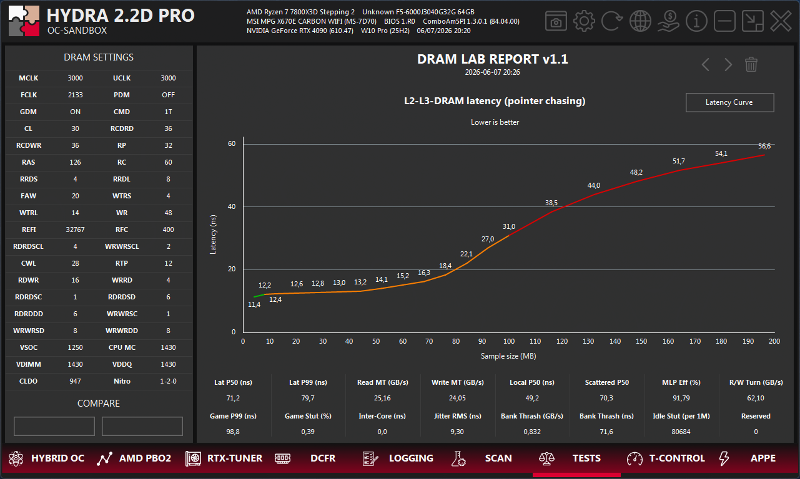

### DRAM: OCCT

#### Benchmark Memory (Read)

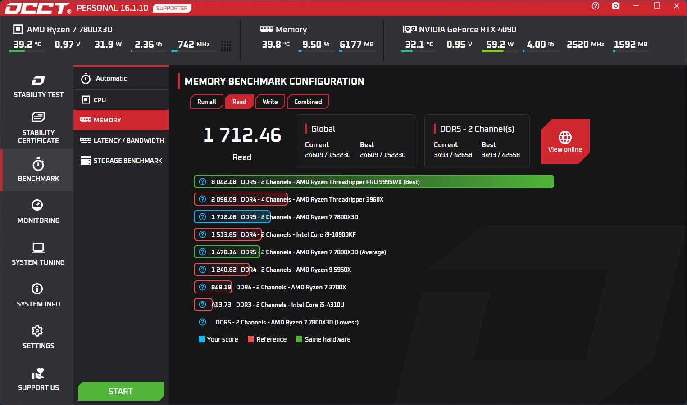

[Benchmark Memory (Read)](https://www.ocbase.com/benchmark/memory/6a25b1c02a6353361843dd8e)

#### Benchmark Memory (Write)

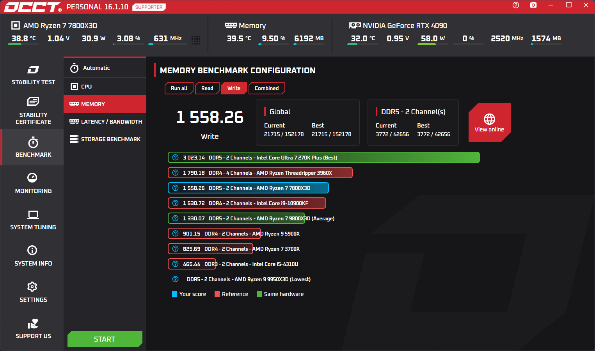

[Benchmark Memory (Write)](https://www.ocbase.com/benchmark/memory/6a25b1c02a6353361843dd8f)

#### Benchmark Memory (Combined)

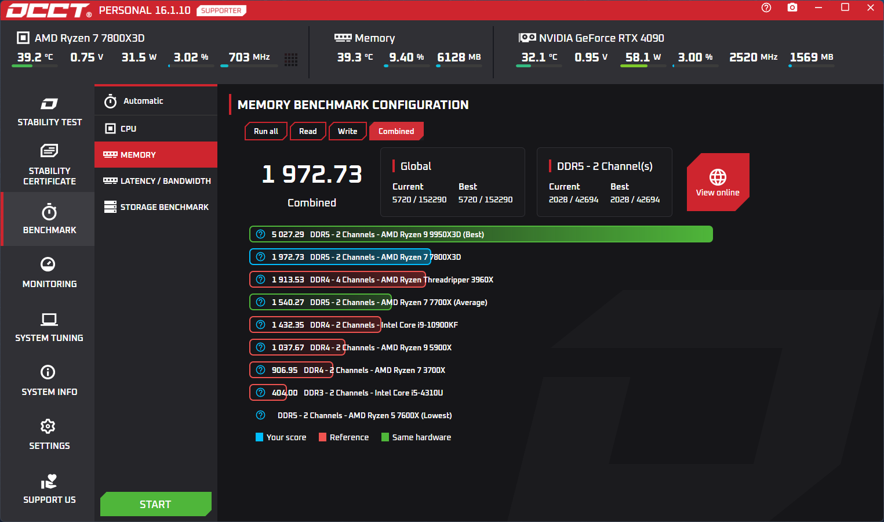

[Benchmark Memory (Combined)](https://www.ocbase.com/benchmark/memory/6a25b1c02a6353361843dd90)

#### Latency / Bandwidth Benchmark

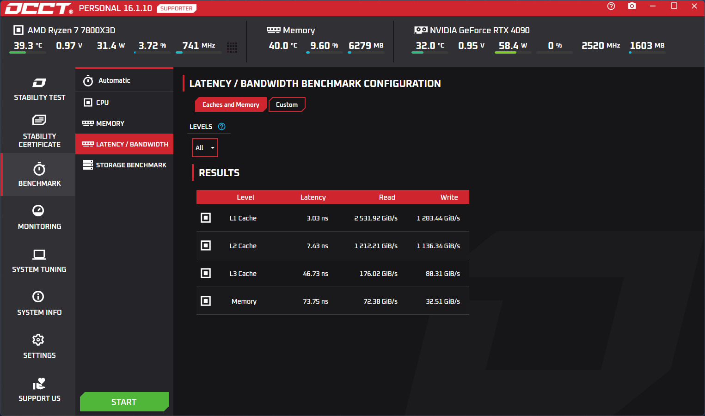

### Karhu Software RAM Test

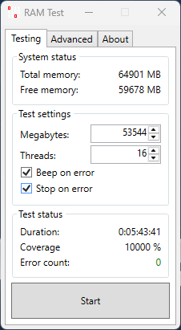

### TestMem5

#### Absolut @ anta777

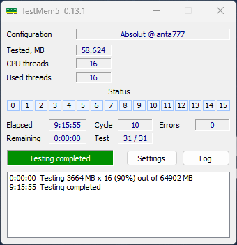

#### Extreme @ anta777

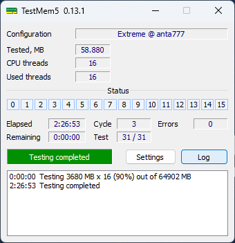

### ZenTimings

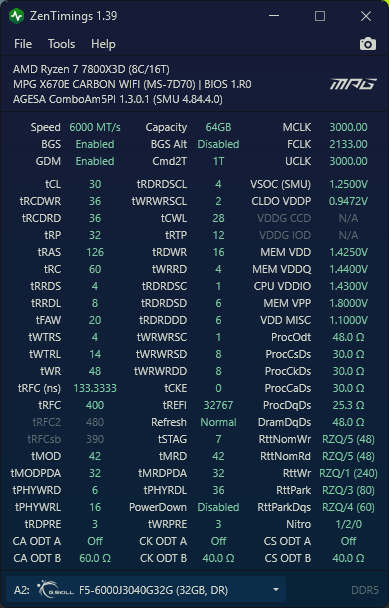

[ZenTimings](./assets/zentimings_dram.html)

## CPU

### CPU: 3DMark

#### CPU Profile

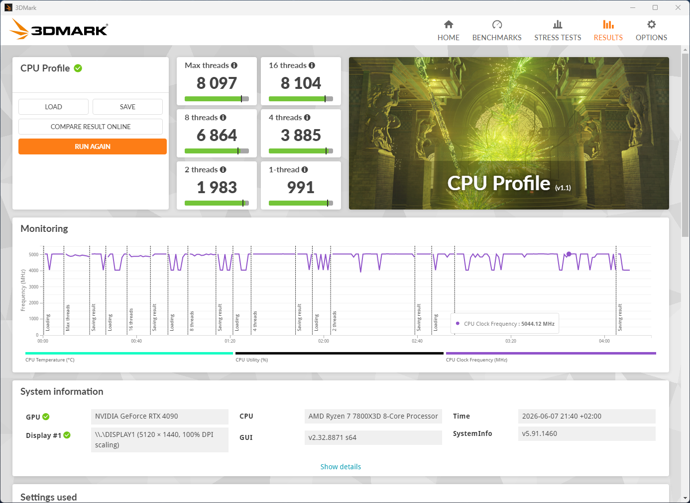

[CPU Profile](https://www.3dmark.com/3dm/158524650?)

### CPU: AIDA64 Extreme

#### CPUID

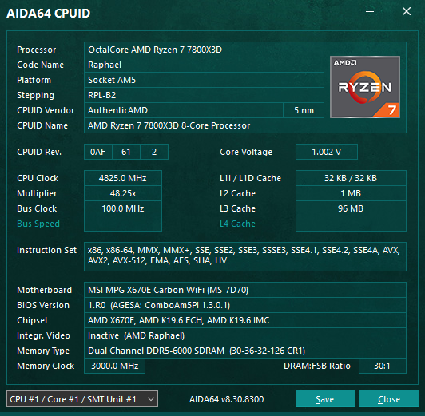

### Cinebench

#### Single Thread

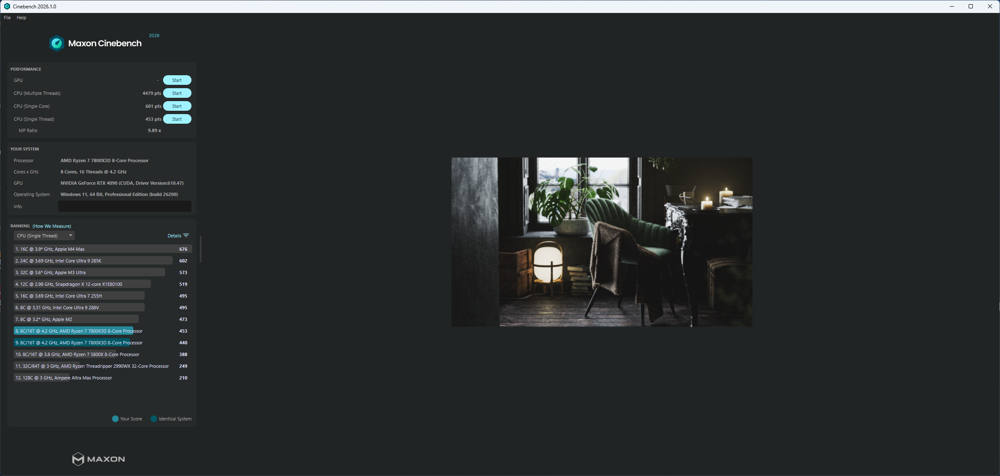

#### Single Core

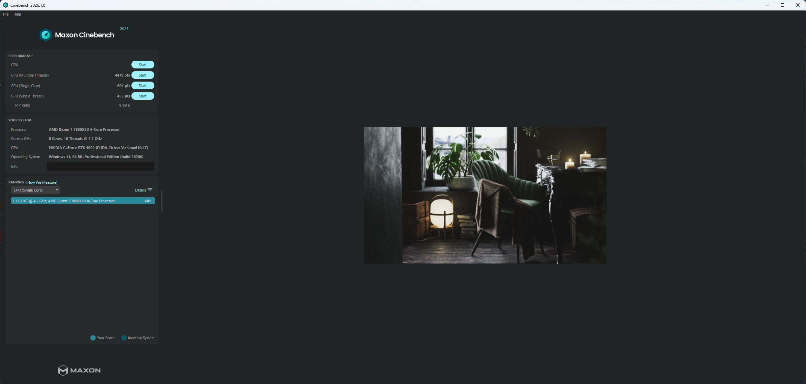

#### Multiple Threads

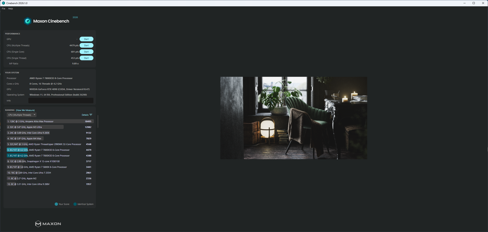

### CPU: HYDRA

#### 1-thread Boost

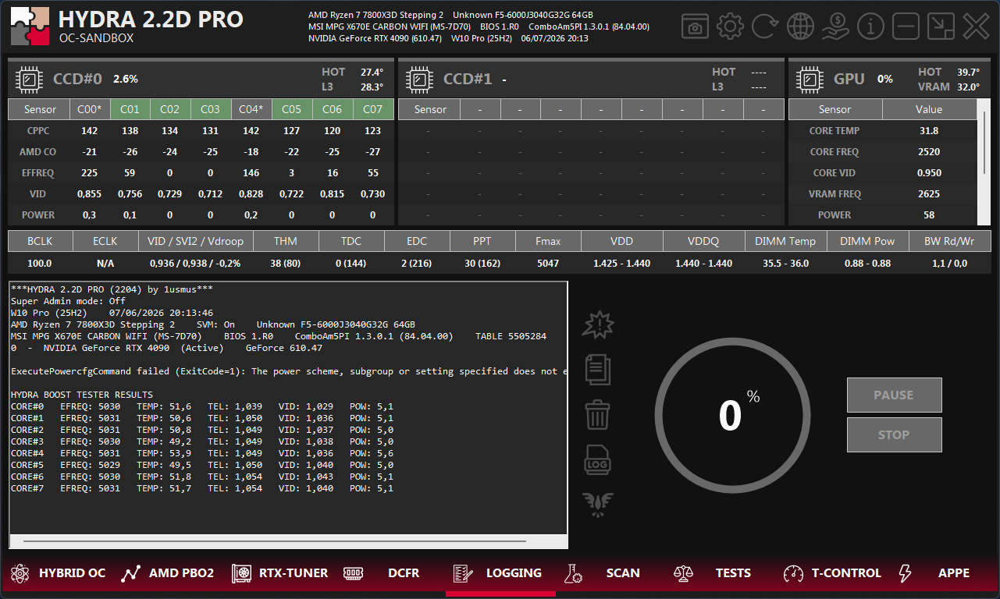

<!-- markdownlint-disable MD013 -->

```text
***HYDRA 2.2D PRO (2204) by 1usmus***
Super Admin mode: Off
W10 Pro (25H2)    07/06/2026 20:13:46
AMD Ryzen 7 7800X3D Stepping 2    SVM: On    Unknown F5-6000J3040G32G 64GB
MSI MPG X670E CARBON WIFI (MS-7D70)    BIOS 1.R0    ComboAm5PI 1.3.0.1 (84.04.00)    TABLE 5505284
0  -  NVIDIA GeForce RTX 4090  (Active)    GeForce 610.47

ExecutePowercfgCommand failed (ExitCode=1): The power scheme, subgroup or setting specified does not exist.

HYDRA BOOST TESTER RESULTS
CORE#0   EFREQ: 5030   TEMP: 51,6   TEL: 1,039   VID: 1,029   POW: 5,1
CORE#1   EFREQ: 5031   TEMP: 50,6   TEL: 1,050   VID: 1,036   POW: 5,1
CORE#2   EFREQ: 5031   TEMP: 50,8   TEL: 1,049   VID: 1,037   POW: 5,0
CORE#3   EFREQ: 5030   TEMP: 49,2   TEL: 1,049   VID: 1,038   POW: 5,0
CORE#4   EFREQ: 5031   TEMP: 53,9   TEL: 1,049   VID: 1,036   POW: 5,6
CORE#5   EFREQ: 5029   TEMP: 49,5   TEL: 1,050   VID: 1,040   POW: 5,0
CORE#6   EFREQ: 5030   TEMP: 51,8   TEL: 1,054   VID: 1,043   POW: 5,1
CORE#7   EFREQ: 5031   TEMP: 51,7   TEL: 1,054   VID: 1,040   POW: 5,1
```

<!-- markdownlint-enable MD013 -->

### Default vs AMD PBO2

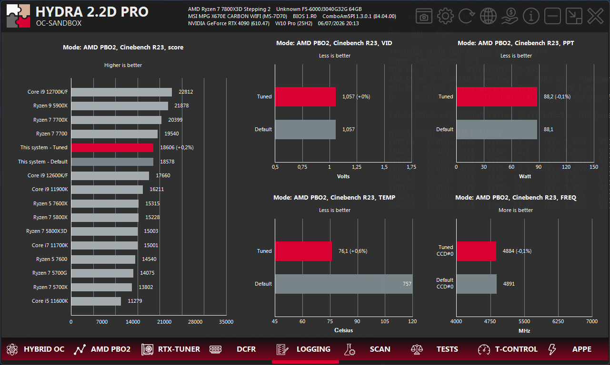

### Find "AMD CO", Normal PBO

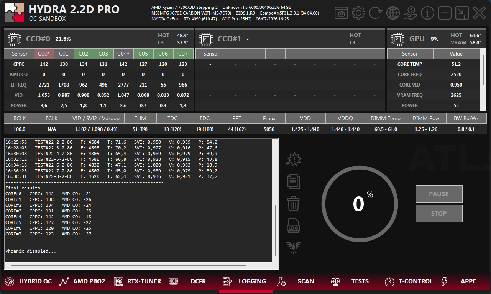

<!-- markdownlint-disable MD013 -->

```text
***HYDRA 2.2D PRO (2204) by 1usmus***
Super Admin mode: Off
W10 Pro (25H2)    07/06/2026 16:23:41
AMD Ryzen 7 7800X3D Stepping 2    SVM: On    Unknown F5-6000J3040G32G 64GB
MSI MPG X670E CARBON WIFI (MS-7D70)    BIOS 1.R0    ComboAm5PI 1.3.0.1 (84.04.00)    TABLE 5505284
0  -  NVIDIA GeForce RTX 4090  (Active)    GeForce 610.47

Restoring the diagnostic process. Please do not take any actions.
ExecutePowercfgCommand failed (ExitCode=1): The power scheme, subgroup or setting specified does not exist.
Attempting to recover CPU diagnostic data...
Used file: phoenix

Phoenix enabled...

AMD CORE CO verification process has begun...
-----------------------------------------------------------
Target PPT: 162
Target EDC: 216
Target TDC: 144
Target THM: 80
Target FIT: 1
Target Fmax: 5750
BCLK: 100
-----------------------------------------------------------
DIAG PHASE: 2   STEP# 29
CCD#0   AMD CO: ( -21X   -26X   -24X   -25X   -18X   -22X   -25X   -27X )   VERIFICATION
16:25:58   TEST#22-2-2-8G   F: 4684   T: 71,6   SVI: 0,950   V: 0,939   P: 54,2
16:28:03   TEST#22-3-2-8G   F: 4593   T: 70,2   SVI: 0,927   V: 0,916   P: 47,6
16:30:08   TEST#22-4-2-8G   F: 4805   T: 65,4   SVI: 0,989   V: 0,979   P: 39,9
16:32:12   TEST#22-5-2-8G   F: 4586   T: 66,8   SVI: 0,928   V: 0,915   P: 43,8
16:34:18   TEST#22-6-2-8G   F: 4832   T: 47,1   SVI: 1,000   V: 0,983   P: 18,9
16:36:25   TEST#22-7-2-8G   F: 4807   T: 65,0   SVI: 0,989   V: 0,979   P: 39,0
16:38:31   TEST#22-8-2-8G   F: 4620   T: 62,4   SVI: 0,936   V: 0,921   P: 37,7
-----------------------------------------------------------
Final results...
CORE#0   CPPC: 142   AMD CO: -21
CORE#1   CPPC: 138   AMD CO: -26
CORE#2   CPPC: 134   AMD CO: -24
CORE#3   CPPC: 131   AMD CO: -25
CORE#4   CPPC: 142   AMD CO: -18
CORE#5   CPPC: 127   AMD CO: -22
CORE#6   CPPC: 120   AMD CO: -25
CORE#7   CPPC: 123   AMD CO: -27
-----------------------------------------------------------

Phoenix disabled...
```

<!-- markdownlint-enable MD013 -->

### Ping Pong Bench

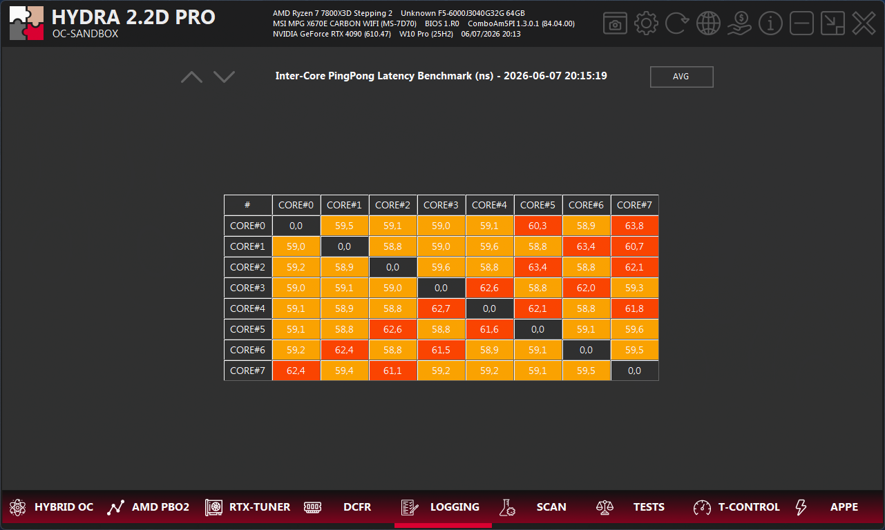

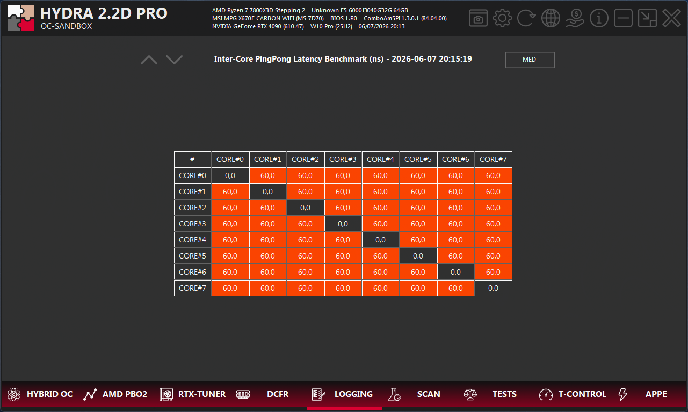

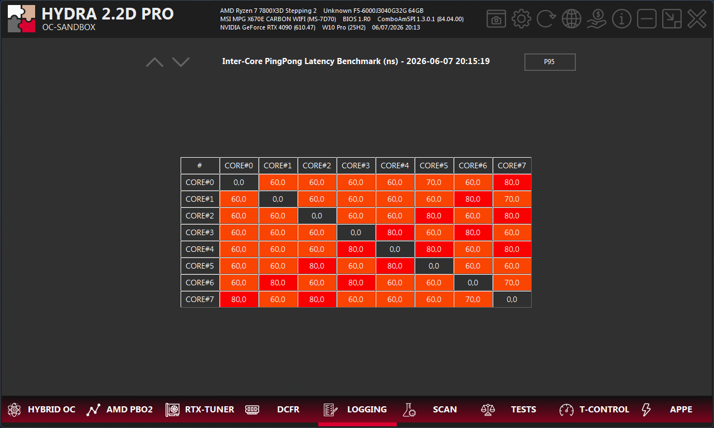

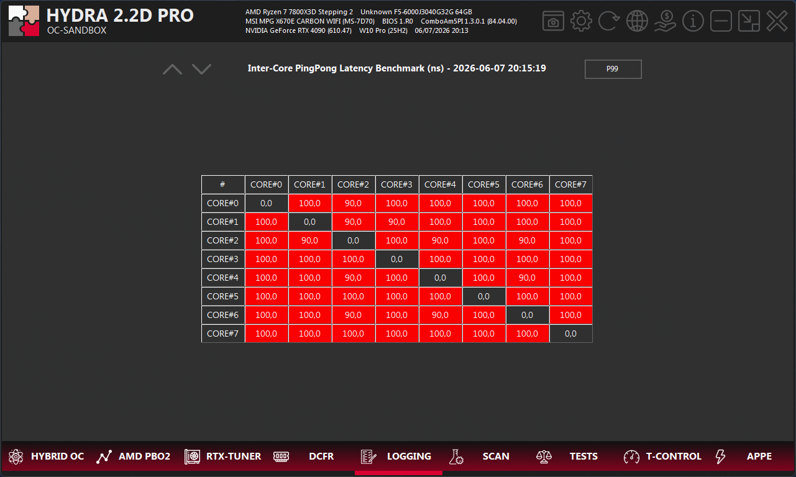

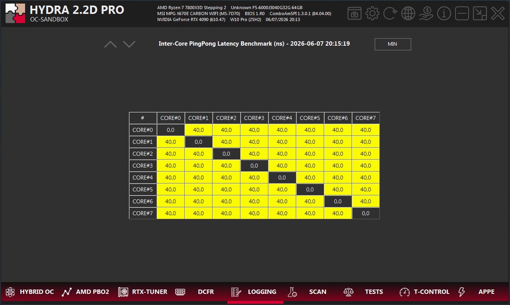

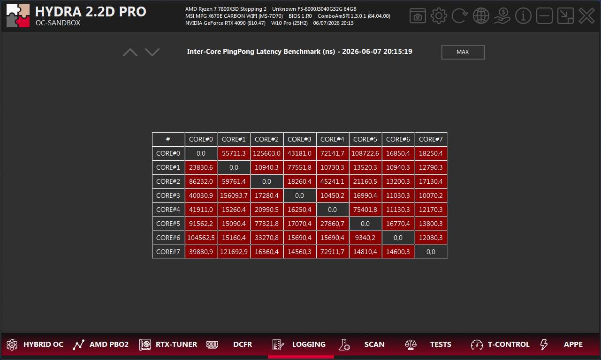

### SQ Agent

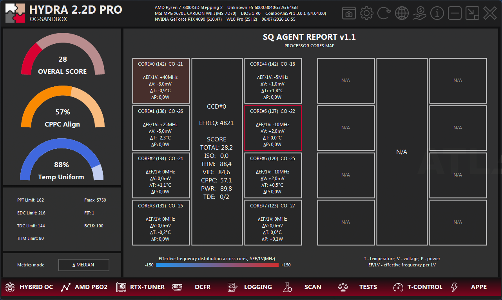

<!-- markdownlint-disable MD013 -->

```text
***HYDRA 2.2D PRO (2204) by 1usmus***
Super Admin mode: Off
W10 Pro (25H2)    07/06/2026 16:55:30
AMD Ryzen 7 7800X3D Stepping 2    SVM: On    Unknown F5-6000J3040G32G 64GB
MSI MPG X670E CARBON WIFI (MS-7D70)    BIOS 1.R0    ComboAm5PI 1.3.0.1 (84.04.00)    TABLE 5505284
0  -  NVIDIA GeForce RTX 4090  (Active)    GeForce 610.47

ExecutePowercfgCommand failed (ExitCode=1): The power scheme, subgroup or setting specified does not exist.

SQ AGENT started...
AMD PBO2 settings
THM: 80 | PPT: 162 | EDC: 216 | TDC: 144
FIT: 1 | BCLK: 100 | ECLK: 100 |Fmax: 5750
Warm-up phase started...
Warm-up finished: duration=68,9s, EMA_medT=65,17°C, slope=0,0500°C/s
=========================================
           QUALITY REPORT
=========================================
Cfg: 40000ms | WarmUp: 20s | Trim: 5%
Limits: None
-----------------------------------------
GLOBAL SCORE : 28,2 (IsoEff: 0,0)
Eff Points   : 11502
V-Droop      : 4,5 mV
CPPC Align   : 57,1 (rho=0,143)

[ CCD #0 ] SCORE: 28,2
  > Thermal  : 88,4 (s=1,23, d=4,0)
  > Volts    : 84,6 (s=3,9mV)
  > CPPC/Pwr : 57,1 / 89,8
  > Iso-Power: 0,0
  > TDE Mean : 0%/2% (Leak/Obstr)

CORE STATISTICS
Core  MHz   VID   Temp   Pow   CO   Mat%  L%/O%
-----------------------------------------------
  0  4821  0,979  64,6   4,9  -21   100    ./.
  1  4821  0,982  63,2   4,9  -26   100    ./.
  2  4821  0,987  66,5   4,9  -24    57    0/4
  3  4821  0,987  65,3   4,9  -25    86    ./.
  4  4821  0,988  67,3   4,9  -18    14    0/7
  5  4821  0,989  65,5   4,9  -22    86    ./.
  6  4821  0,989  65,9   4,9  -25    71    0/2
  7  4821  0,987  65,4   5,0  -27    57    ./.
-----------------------------------------------
```

<!-- markdownlint-enable MD013 -->

### Verification AMD CO

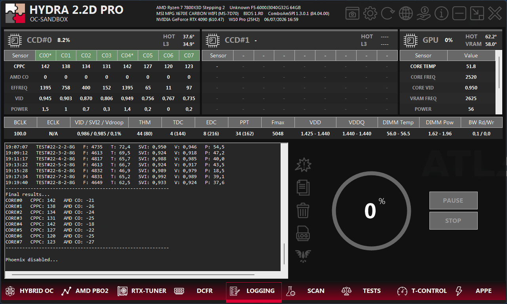

<!-- markdownlint-disable MD013 -->

```text
***HYDRA 2.2D PRO (2204) by 1usmus***
Super Admin mode: Off
W10 Pro (25H2)    07/06/2026 16:59:38
AMD Ryzen 7 7800X3D Stepping 2    SVM: On    Unknown F5-6000J3040G32G 64GB
MSI MPG X670E CARBON WIFI (MS-7D70)    BIOS 1.R0    ComboAm5PI 1.3.0.1 (84.04.00)    TABLE 5505284
0  -  NVIDIA GeForce RTX 4090  (Active)    GeForce 610.47

ExecutePowercfgCommand failed (ExitCode=1): The power scheme, subgroup or setting specified does not exist.

Phoenix enabled...

AMD CORE CO search process has begun...
-----------------------------------------------------------
Target PPT: 162
Target EDC: 216
Target TDC: 144
Target THM: 80
Target FIT: 1
Target Fmax: 5750
BCLK: 100
-----------------------------------------------------------
Phoenix resume flag detected. Verification cycle will start immediately.
DIAG PHASE: 0   STEP# 1
CCD#0   AMD CO: ( -21   -26   -24   -25   -18   -22   -25   -27 )   CORE#4 (142)   VERIFICATION
17:04:00   TEST#22-3-2-96   F: 4732   T: 58,5   SVI: 0,947   V: 0,935   P: 6,3
17:08:09   TEST#22-4-2-96   F: 4853   T: 51,8   SVI: 0,985   V: 0,974   P: 4,8
17:12:18   TEST#22-5-2-96   F: 4752   T: 54,6   SVI: 0,953   V: 0,941   P: 5,7
17:16:28   TEST#22-6-2-512   F: 4729   T: 54,6   SVI: 0,946   V: 0,935   P: 6,0
17:20:39   TEST#22-7-2-2G   F: 4855   T: 53,5   SVI: 0,992   V: 0,974   P: 5,0
17:24:50   TEST#22-8-2-2G   F: 4798   T: 55,0   SVI: 0,960   V: 0,952   P: 5,6
-----------------------------------------------------------
DIAG PHASE: 0   STEP# 2
CCD#0   AMD CO: ( -21   -26   -24   -25   -18   -22   -25   -27 )   CORE#0 (142)   VERIFICATION
17:29:00   TEST#22-3-2-96   F: 4734   T: 59,1   SVI: 0,947   V: 0,930   P: 6,3
17:33:09   TEST#22-4-2-96   F: 4854   T: 52,3   SVI: 0,984   V: 0,968   P: 4,8
17:37:18   TEST#22-5-2-96   F: 4743   T: 54,9   SVI: 0,948   V: 0,932   P: 5,8
17:41:28   TEST#22-6-2-512   F: 4734   T: 54,5   SVI: 0,947   V: 0,931   P: 6,0
17:45:38   TEST#22-7-2-2G   F: 4855   T: 53,5   SVI: 0,991   V: 0,968   P: 5,0
17:49:48   TEST#22-8-2-2G   F: 4784   T: 55,6   SVI: 0,959   V: 0,942   P: 5,6
-----------------------------------------------------------
DIAG PHASE: 0   STEP# 3
CCD#0   AMD CO: ( -21   -26   -24   -25   -18   -22   -25   -27 )   CORE#1 (138)   VERIFICATION
17:51:54   TEST#22-3-2-96   F: 4729   T: 58,1   SVI: 0,947   V: 0,933   P: 6,3
17:53:59   TEST#22-4-2-96   F: 4852   T: 51,2   SVI: 0,985   V: 0,972   P: 4,8
17:56:04   TEST#22-5-2-96   F: 4752   T: 54,2   SVI: 0,953   V: 0,939   P: 5,7
17:58:08   TEST#22-6-2-512   F: 4726   T: 54,5   SVI: 0,946   V: 0,932   P: 6,0
18:00:15   TEST#22-7-2-2G   F: 4931   T: 56,4   SVI: 1,018   V: 1,009   P: 5,4
18:02:20   TEST#22-8-2-2G   F: 4803   T: 54,9   SVI: 0,965   V: 0,955   P: 5,6
-----------------------------------------------------------
DIAG PHASE: 0   STEP# 4
CCD#0   AMD CO: ( -21   -26   -24   -25   -18   -22   -25   -27 )   CORE#2 (134)   VERIFICATION
18:04:26   TEST#22-3-2-96   F: 4732   T: 58,2   SVI: 0,947   V: 0,935   P: 6,3
18:06:30   TEST#22-4-2-96   F: 4853   T: 51,6   SVI: 0,984   V: 0,974   P: 4,8
18:08:35   TEST#22-5-2-96   F: 4752   T: 54,6   SVI: 0,953   V: 0,940   P: 5,7
18:10:40   TEST#22-6-2-512   F: 4730   T: 54,5   SVI: 0,947   V: 0,935   P: 5,9
18:12:47   TEST#22-7-2-2G   F: 4931   T: 56,8   SVI: 1,017   V: 1,008   P: 5,4
18:14:53   TEST#22-8-2-2G   F: 4804   T: 55,1   SVI: 0,964   V: 0,956   P: 5,6
-----------------------------------------------------------
DIAG PHASE: 0   STEP# 5
CCD#0   AMD CO: ( -21   -26   -24   -25   -18   -22   -25   -27 )   CORE#3 (131)   VERIFICATION
18:16:59   TEST#22-3-2-96   F: 4726   T: 57,2   SVI: 0,947   V: 0,935   P: 6,3
18:19:03   TEST#22-4-2-96   F: 4851   T: 50,6   SVI: 0,984   V: 0,975   P: 4,8
18:21:08   TEST#22-5-2-96   F: 4747   T: 53,4   SVI: 0,952   V: 0,940   P: 5,7
18:23:13   TEST#22-6-2-512   F: 4724   T: 53,4   SVI: 0,946   V: 0,934   P: 5,9
18:25:19   TEST#22-7-2-2G   F: 4932   T: 55,8   SVI: 1,019   V: 1,011   P: 5,4
18:27:25   TEST#22-8-2-2G   F: 4802   T: 54,2   SVI: 0,963   V: 0,954   P: 5,6
-----------------------------------------------------------
DIAG PHASE: 0   STEP# 6
CCD#0   AMD CO: ( -21   -26   -24   -25   -18   -22   -25   -27 )   CORE#5 (127)   VERIFICATION
18:29:31   TEST#22-3-2-96   F: 4723   T: 57,0   SVI: 0,950   V: 0,938   P: 6,3
18:31:36   TEST#22-4-2-96   F: 4854   T: 50,5   SVI: 0,987   V: 0,977   P: 4,8
18:33:41   TEST#22-5-2-96   F: 4751   T: 53,6   SVI: 0,954   V: 0,942   P: 5,8
18:35:46   TEST#22-6-2-512   F: 4729   T: 53,7   SVI: 0,947   V: 0,937   P: 5,9
18:37:52   TEST#22-7-2-2G   F: 4929   T: 55,6   SVI: 1,019   V: 1,010   P: 5,4
18:39:57   TEST#22-8-2-2G   F: 4800   T: 53,8   SVI: 0,961   V: 0,954   P: 5,6
-----------------------------------------------------------
DIAG PHASE: 0   STEP# 7
CCD#0   AMD CO: ( -21   -26   -24   -25   -18   -22   -25   -27 )   CORE#7 (123)   VERIFICATION
18:42:03   TEST#22-3-2-96   F: 4729   T: 59,1   SVI: 0,947   V: 0,935   P: 6,3
18:44:08   TEST#22-4-2-96   F: 4851   T: 51,9   SVI: 0,984   V: 0,974   P: 4,8
18:46:12   TEST#22-5-2-96   F: 4748   T: 55,2   SVI: 0,951   V: 0,941   P: 5,7
18:48:17   TEST#22-6-2-512   F: 4729   T: 55,6   SVI: 0,947   V: 0,936   P: 6,0
18:50:22   TEST#22-7-2-2G   F: 4853   T: 53,8   SVI: 0,985   V: 0,975   P: 4,9
18:52:28   TEST#22-8-2-2G   F: 4779   T: 55,4   SVI: 0,958   V: 0,948   P: 5,5
-----------------------------------------------------------
DIAG PHASE: 0   STEP# 8
CCD#0   AMD CO: ( -21   -26   -24   -25   -18   -22   -25   -27 )   CORE#6 (120)   VERIFICATION
18:54:34   TEST#22-3-2-96   F: 4727   T: 59,9   SVI: 0,949   V: 0,937   P: 6,3
18:56:39   TEST#22-4-2-96   F: 4855   T: 52,9   SVI: 0,987   V: 0,976   P: 4,8
18:58:43   TEST#22-5-2-96   F: 4732   T: 56,1   SVI: 0,948   V: 0,938   P: 5,8
19:00:48   TEST#22-6-2-512   F: 4731   T: 56,2   SVI: 0,947   V: 0,937   P: 6,0
19:02:54   TEST#22-7-2-2G   F: 4855   T: 54,4   SVI: 0,988   V: 0,977   P: 5,0
19:05:00   TEST#22-8-2-2G   F: 4780   T: 56,1   SVI: 0,959   V: 0,950   P: 5,6
-----------------------------------------------------------
DIAG PHASE: 2   STEP# 9
CCD#0   AMD CO: ( -21   -26   -24   -25   -18   -22   -25   -27 )   VERIFICATION
19:07:07   TEST#22-2-2-8G   F: 4735   T: 72,4   SVI: 0,950   V: 0,946   P: 54,5
19:09:12   TEST#22-3-2-8G   F: 4613   T: 69,5   SVI: 0,924   V: 0,918   P: 47,2
19:11:17   TEST#22-4-2-8G   F: 4817   T: 65,7   SVI: 0,988   V: 0,985   P: 40,0
19:13:22   TEST#22-5-2-8G   F: 4613   T: 66,7   SVI: 0,924   V: 0,917   P: 43,5
19:15:28   TEST#22-6-2-8G   F: 4832   T: 46,9   SVI: 0,989   V: 0,979   P: 18,5
19:17:34   TEST#22-7-2-8G   F: 4831   T: 65,2   SVI: 0,992   V: 0,989   P: 39,1
19:19:40   TEST#22-8-2-8G   F: 4649   T: 62,5   SVI: 0,933   V: 0,924   P: 37,6
-----------------------------------------------------------
Final results...
CORE#0   CPPC: 142   AMD CO: -21
CORE#1   CPPC: 138   AMD CO: -26
CORE#2   CPPC: 134   AMD CO: -24
CORE#3   CPPC: 131   AMD CO: -25
CORE#4   CPPC: 142   AMD CO: -18
CORE#5   CPPC: 127   AMD CO: -22
CORE#6   CPPC: 120   AMD CO: -25
CORE#7   CPPC: 123   AMD CO: -27
-----------------------------------------------------------

Phoenix disabled...
```

<!-- markdownlint-enable MD013 -->

### CPU: OCCT

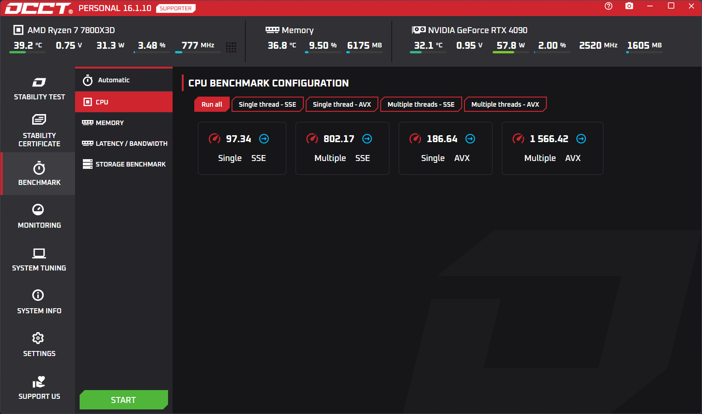

#### Benchmark CPU (single, SSE)

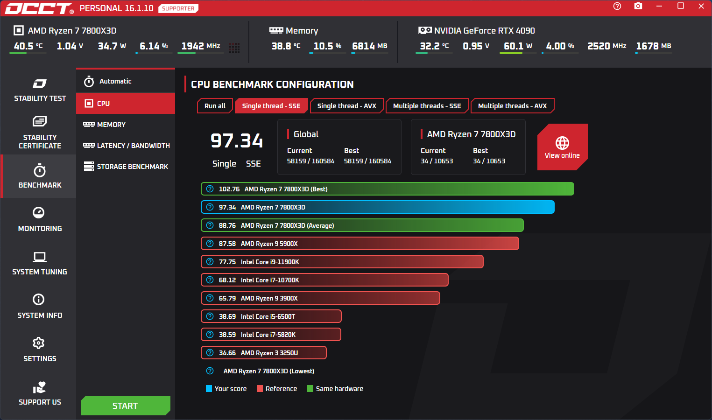

[Benchmark CPU (single, SSE)](https://www.ocbase.com/benchmark/cpu/6a25b18c5d182eb47916fa08)

#### Benchmark CPU (single, AVX)

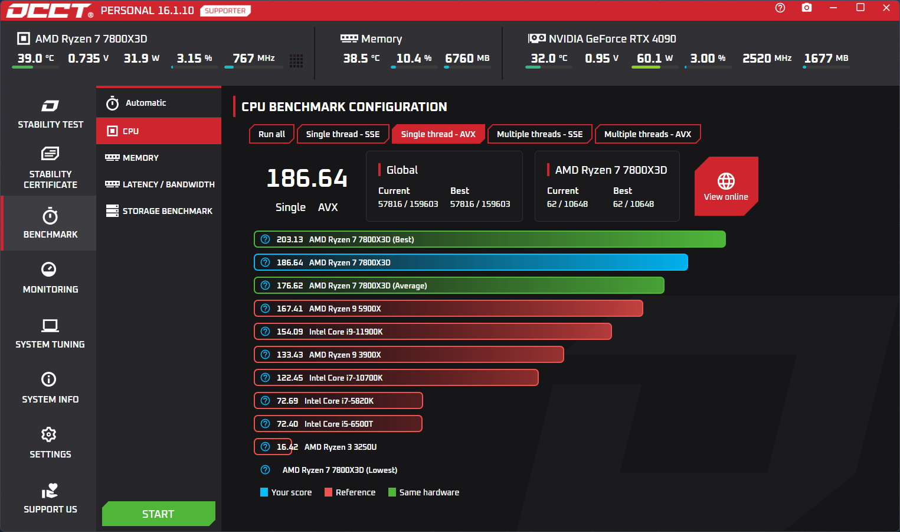

[Benchmark CPU (single, AVX)](https://www.ocbase.com/benchmark/cpu/6a25b18d5d182eb47916fa0a)

#### Benchmark CPU (multiple, SSE)

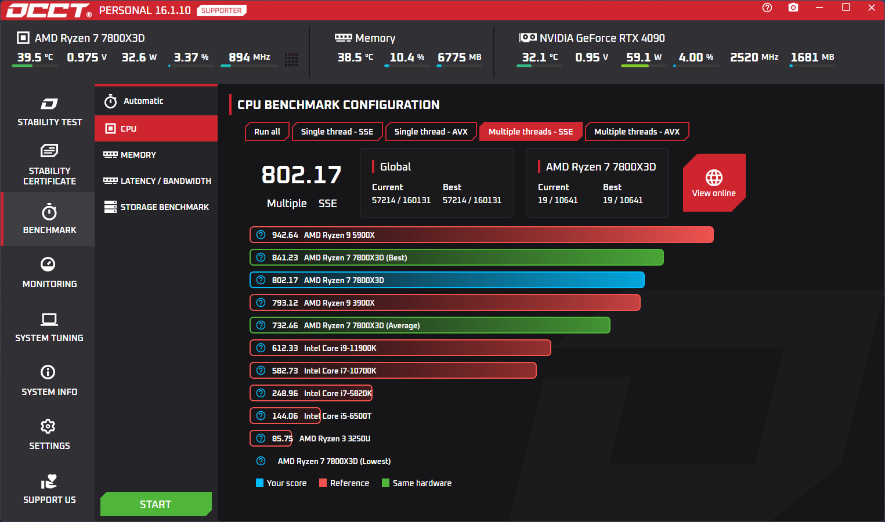

[Benchmark CPU (multiple, SSE)](https://www.ocbase.com/benchmark/cpu/6a25b18d5d182eb47916fa09)

#### Benchmark CPU (multiple, AVX)

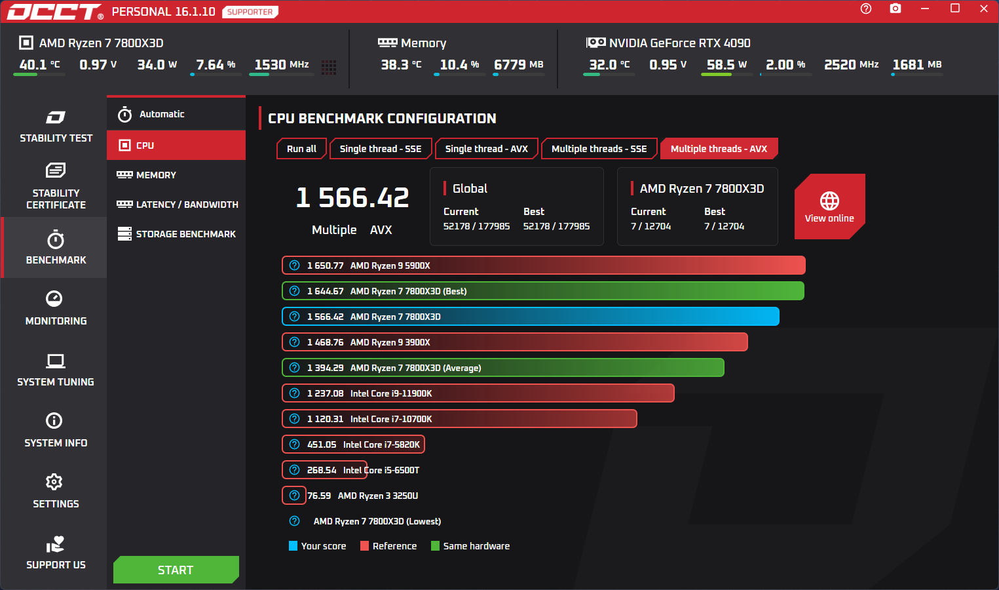

[Benchmark CPU (multiple, AVX)](https://www.ocbase.com/benchmark/cpu/6a25b18e5d182eb47916fa0b)

## Storage

### Storage: 3DMark

#### Storage Benchmark

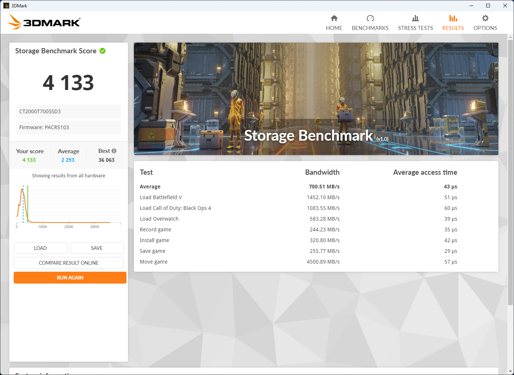

[Storage Benchmark](https://www.3dmark.com/strg/263859)

### Storage: AIDA64 Extreme

#### Disk Benchmark

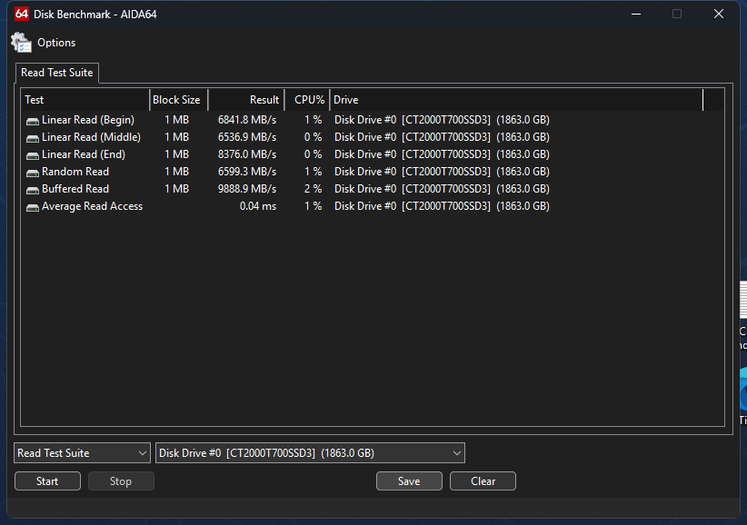

### CrystalDiskInfo

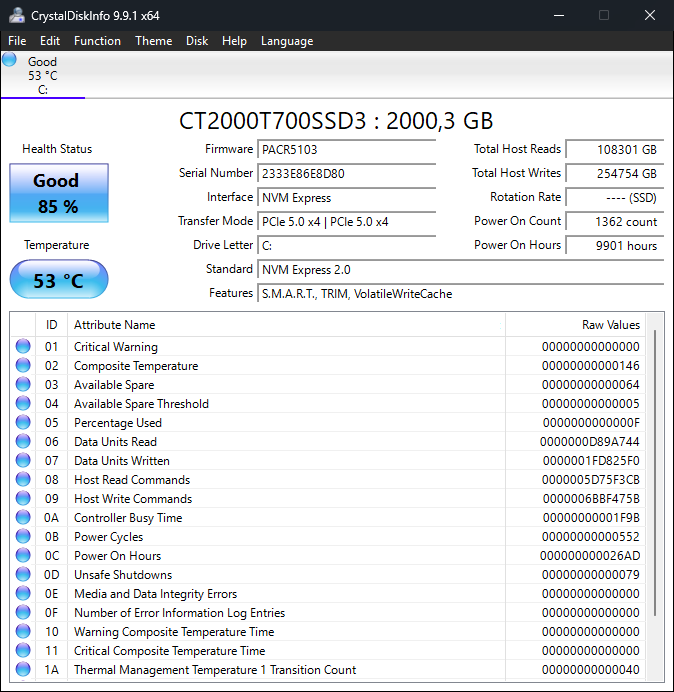

```text
----------------------------------------------------------------------------
CrystalDiskInfo 9.9.1 (C) 2008-2026 hiyohiyo
                                Crystal Dew World: https://crystalmark.info/
----------------------------------------------------------------------------

    OS : Windows 11 Pro 25H2 [10.0 Build 26200] (x64)
  Date : 2026/06/07 19:28:51

-- Controller Map ----------------------------------------------------------
 - Standard SATA AHCI Controller [ATA]
 - Standard SATA AHCI Controller [ATA]
 - Microsoft Storage Spaces Controller [SCSI]
 - Xvdd SCSI Miniport [SCSI]
 + Standard NVM Express Controller [SCSI]
   - CT2000T700SSD3

-- Disk List ---------------------------------------------------------------
 (01) CT2000T700SSD3 : 2000,3 GB [0/2/0, sq] - nv

----------------------------------------------------------------------------
 (01) CT2000T700SSD3
----------------------------------------------------------------------------
           Model : CT2000T700SSD3
        Firmware : PACR5103
   Serial Number : 2333E86E8D80
       Disk Size : 2000,3 GB
       Interface : NVM Express
        Standard : NVM Express 2.0
   Transfer Mode : PCIe 5.0 x4 | PCIe 5.0 x4
  Power On Hours : 9901 hours
  Power On Count : 1362 count
      Host Reads : 108301 GB
     Host Writes : 254754 GB
     Temperature : 53 C (127 F)
   Health Status : Good (85 %)
        Features : S.M.A.R.T., TRIM, VolatileWriteCache
    Drive Letter : C:

-- S.M.A.R.T. --------------------------------------------------------------
ID RawValues(6) Attribute Name
01 000000000000 Critical Warning
02 000000000146 Composite Temperature
03 000000000064 Available Spare
04 000000000005 Available Spare Threshold
05 00000000000F Percentage Used
06 00000D89A744 Data Units Read
07 00001FD825F0 Data Units Written
08 00005D75F3CB Host Read Commands
09 00006BBF475B Host Write Commands
0A 000000001F9B Controller Busy Time
0B 000000000552 Power Cycles
0C 0000000026AD Power On Hours
0D 000000000079 Unsafe Shutdowns
0E 000000000000 Media and Data Integrity Errors
0F 000000000000 Number of Error Information Log Entries
10 000000000000 Warning Composite Temperature Time
11 000000000000 Critical Composite Temperature Time
1A 000000000040 Thermal Management Temperature 1 Transition Count
1B 000000000004 Thermal Management Temperature 2 Transition Count
1C 000000001B46 Total Time For Thermal Management Temperature 1
1D 00000000004A Total Time For Thermal Management Temperature 2

-- IDENTIFY_DEVICE ---------------------------------------------------------
        0    1    2    3    4    5    6    7    8    9
000: C0A9 C0A9 3332 3333 3845 4536 4438 3038 2020 2020
010: 2020 2020 5443 3032 3030 3754 3030 5353 3344 2020
020: 2020 2020 2020 2020 2020 2020 2020 2020 2020 2020
030: 2020 2020 4150 5243 3135 3330 7501 00A0 0700 0000
040: 0000 0002 3500 000C 91C0 0021 0200 0000 0000 0000
050: 0000 0000 0000 0000 0000 0100 0000 0000 0000 0000
060: 0000 0000 0000 0000 0000 0000 0000 0000 0000 0000
070: 0000 0000 0000 0000 0000 0000 0000 0000 0000 0000
080: 0000 0000 0000 0000 0000 0000 0000 0000 0000 0000
090: 0000 0000 0000 0000 0000 0000 0000 0000 0000 0000
100: 0000 0000 0000 0000 0000 0000 0000 0000 0000 0000
110: 0000 0000 0000 0000 0000 0000 0000 0000 0000 0000
120: 0000 0000 0000 0000 0000 0000 0000 0000 0017 0300
130: 3E12 040F 0101 0168 016A 0064 0000 0000 0000 0000
140: 0000 0000 0000 0000 0000 0000 0000 0000 0000 0000
150: 0000 0000 0000 0000 0000 0000 0000 0000 0015 0401
160: 0000 0001 0111 0166 0002 6000 0000 0000 0000 0000
170: 0000 0000 0000 0000 0000 0000 0063 0000 0000 0000
180: 0000 0000 0000 0000 0000 0000 0000 0000 0000 0000
190: 0000 0000 0000 0000 0000 0000 0000 0000 0000 0000
200: 0000 0000 0000 0000 0000 0000 0000 0000 0000 0000
210: 0000 0000 0000 0000 0000 0000 0000 0000 0000 0000
220: 0000 0000 0000 0000 0000 0000 0000 0000 0000 0000
230: 0000 0000 0000 0000 0000 0000 0000 0000 0000 0000
240: 0000 0000 0000 0000 0000 0000 0000 0000 0000 0000
250: 0000 0000 0000 0000 0000 0000

-- SMART_NVME --------------------------------------------------------------
     +0 +1 +2 +3 +4 +5 +6 +7 +8 +9 +A +B +C +D +E +F
000: 00 46 01 64 05 0F 00 00 00 00 00 00 00 00 00 00
010: 00 00 00 00 00 00 00 00 00 00 00 00 00 00 00 00
020: 44 A7 89 0D 00 00 00 00 00 00 00 00 00 00 00 00
030: F0 25 D8 1F 00 00 00 00 00 00 00 00 00 00 00 00
040: CB F3 75 5D 00 00 00 00 00 00 00 00 00 00 00 00
050: 5B 47 BF 6B 00 00 00 00 00 00 00 00 00 00 00 00
060: 9B 1F 00 00 00 00 00 00 00 00 00 00 00 00 00 00
070: 52 05 00 00 00 00 00 00 00 00 00 00 00 00 00 00
080: AD 26 00 00 00 00 00 00 00 00 00 00 00 00 00 00
090: 79 00 00 00 00 00 00 00 00 00 00 00 00 00 00 00
0A0: 00 00 00 00 00 00 00 00 00 00 00 00 00 00 00 00
0B0: 00 00 00 00 00 00 00 00 00 00 00 00 00 00 00 00
0C0: 00 00 00 00 00 00 00 00 00 00 00 00 00 00 00 00
0D0: 00 00 00 00 00 00 00 00 40 00 00 00 04 00 00 00
0E0: 46 1B 00 00 4A 00 00 00 00 00 00 00 00 00 00 00
0F0: 00 00 00 00 00 00 00 00 00 00 00 00 00 00 00 00
100: 00 00 00 00 00 00 00 00 00 00 00 00 00 00 00 00
110: 00 00 00 00 00 00 00 00 00 00 00 00 00 00 00 00
120: 00 00 00 00 00 00 00 00 00 00 00 00 00 00 00 00
130: 00 00 00 00 00 00 00 00 00 00 00 00 00 00 00 00
140: 00 00 00 00 00 00 00 00 00 00 00 00 00 00 00 00
150: 00 00 00 00 00 00 00 00 00 00 00 00 00 00 00 00
160: 00 00 00 00 00 00 00 00 00 00 00 00 00 00 00 00
170: 00 00 00 00 00 00 00 00 00 00 00 00 00 00 00 00
180: 00 00 00 00 00 00 00 00 00 00 00 00 00 00 00 00
190: 00 00 00 00 00 00 00 00 00 00 00 00 00 00 00 00
1A0: 00 00 00 00 00 00 00 00 00 00 00 00 00 00 00 00
1B0: 00 00 00 00 00 00 00 00 00 00 00 00 00 00 00 00
1C0: 00 00 00 00 00 00 00 00 00 00 00 00 00 00 00 00
1D0: 00 00 00 00 00 00 00 00 00 00 00 00 00 00 00 00
1E0: 00 00 00 00 00 00 00 00 00 00 00 00 00 00 00 00
1F0: 00 00 00 00 00 00 00 00 00 00 00 00 00 00 00 00
```

### CrystalDiskMark

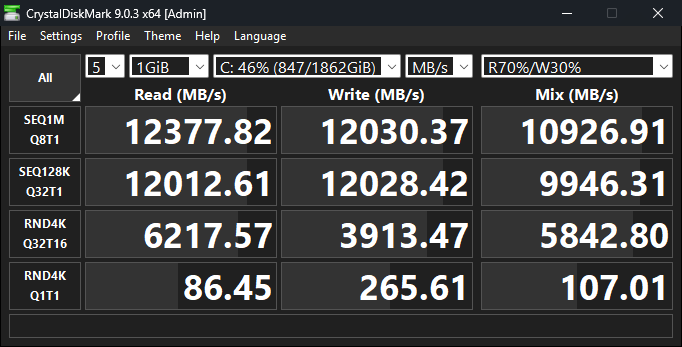

```text
------------------------------------------------------------------------------
CrystalDiskMark 9.0.3 x64 (C) 2007-2026 hiyohiyo
                                  Crystal Dew World: https://crystalmark.info/
------------------------------------------------------------------------------
* MB/s = 1,000,000 bytes/s [SATA/600 = 600,000,000 bytes/s]
* KB = 1000 bytes, KiB = 1024 bytes

[Read]
  SEQ    1MiB (Q=  8, T= 1): 12377.822 MB/s [  11804.4 IOPS] <   677.21 us>
  SEQ  128KiB (Q= 32, T= 1): 12012.613 MB/s [  91649.0 IOPS] <   341.73 us>
  RND    4KiB (Q= 32, T=16):  6217.568 MB/s [1517960.9 IOPS] <   190.50 us>
  RND    4KiB (Q=  1, T= 1):    86.447 MB/s [  21105.2 IOPS] <    47.29 us>

[Write]
  SEQ    1MiB (Q=  8, T= 1): 12030.373 MB/s [  11473.1 IOPS] <   696.45 us>
  SEQ  128KiB (Q= 32, T= 1): 12028.424 MB/s [  91769.6 IOPS] <   346.91 us>
  RND    4KiB (Q= 32, T=16):  3913.469 MB/s [ 955436.8 IOPS] <    38.99 us>
  RND    4KiB (Q=  1, T= 1):   265.611 MB/s [  64846.4 IOPS] <    15.34 us>

[Mix] Read 70%/Write 30%
  SEQ    1MiB (Q=  8, T= 1): 10926.913 MB/s [  10420.7 IOPS] <   765.80 us>
  SEQ  128KiB (Q= 32, T= 1):  9946.308 MB/s [  75884.3 IOPS] <   416.26 us>
  RND    4KiB (Q= 32, T=16):  5842.796 MB/s [1426463.9 IOPS] <   101.88 us>
  RND    4KiB (Q=  1, T= 1):   107.011 MB/s [  26125.7 IOPS] <    38.18 us>

Profile: Default
   Test: 1 GiB (x5) [C: 46% (847/1862GiB)]
   Mode: [Admin]
   Time: Measure 5 sec / Interval 5 sec
   Date: 2026/06/07 19:36:24
     OS: Windows 11 Pro 25H2 [10.0 Build 26200] (x64)
```

### DiskSpd

<!-- markdownlint-disable MD013 -->

```text
Command Line: C:\Users\Patrick Godschalk\AppData\Local\Programs\DiskSpd\x86\diskspd.exe -c200G -d900 -w100 -b1M -o16 -t1 -Sh C:\ssd_soak.dat

Input parameters:

        timespan:   1
        -------------
        duration: 900s
        warm up time: 5s
        cool down time: 0s
        random seed: 0
        path: 'C:\ssd_soak.dat'
                think time: 0ms
                burst size: 0
                software cache disabled
                hardware write cache disabled, writethrough on
                performing write test
                block size: 1MiB
                using sequential I/O (stride: 1MiB)
                number of outstanding I/O operations per thread: 16
                threads per file: 1
                using I/O Completion Ports
                IO priority: normal

System information:

        computer name: DESKTOP-DMVVPQI
        start time: 2026/06/07 17:52:29 UTC

        cpu count:              16
        core count:             8
        group count:            1
        node count:             1
        socket count:           1
        heterogeneous cores:    n

        active power scheme:    HYDRA (23bd5cb3-b3ef-4d68-8a6e-a905d85d1760)

Results for timespan 1:
*******************************************************************************

actual test time:       900.01s
thread count:           1

Core | CPU |  Usage |  User  | Kernel |  Idle
-----------------------------------------------
    0|    0|  10.04%|   0.66%|   9.37%|  89.96%
    0|    1|   1.09%|   0.35%|   0.73%|  98.91%
    1|    2|   0.29%|   0.08%|   0.21%|  99.71%
    1|    3|   0.19%|   0.06%|   0.13%|  99.81%
    2|    4|   0.18%|   0.05%|   0.14%|  99.82%
    2|    5|   0.10%|   0.04%|   0.07%|  99.90%
    3|    6|   0.07%|   0.02%|   0.05%|  99.93%
    3|    7|   0.09%|   0.02%|   0.07%|  99.91%
    4|    8|   1.51%|   0.56%|   0.95%|  98.49%
    4|    9|   0.86%|   0.32%|   0.54%|  99.14%
    5|   10|   0.04%|   0.01%|   0.03%|  99.96%
    5|   11|   0.05%|   0.01%|   0.04%|  99.95%
    6|   12|   0.01%|   0.00%|   0.01%|  99.99%
    6|   13|   0.00%|   0.00%|   0.00%| 100.00%
    7|   14|   0.02%|   0.00%|   0.02%|  99.98%
    7|   15|   0.14%|   0.03%|   0.11%|  99.86%
-----------------------------------------------
       avg.|   0.92%|   0.14%|   0.78%|  99.08%

Total IO
thread |       bytes     |     I/Os     |    MiB/s   |  I/O per s |  file
------------------------------------------------------------------------------
     0 |   4879420489728 |      4653378 |    5170.35 |    5170.35 | C:\ssd_soak.dat (200GiB)
------------------------------------------------------------------------------
total:     4879420489728 |      4653378 |    5170.35 |    5170.35

Read IO
thread |       bytes     |     I/Os     |    MiB/s   |  I/O per s |  file
------------------------------------------------------------------------------
     0 |               0 |            0 |       0.00 |       0.00 | C:\ssd_soak.dat (200GiB)
------------------------------------------------------------------------------
total:                 0 |            0 |       0.00 |       0.00

Write IO
thread |       bytes     |     I/Os     |    MiB/s   |  I/O per s |  file
------------------------------------------------------------------------------
     0 |   4879420489728 |      4653378 |    5170.35 |    5170.35 | C:\ssd_soak.dat (200GiB)
------------------------------------------------------------------------------
total:     4879420489728 |      4653378 |    5170.35 |    5170.35
```

<!-- markdownlint-enable MD013 -->

### Storage: OCCT

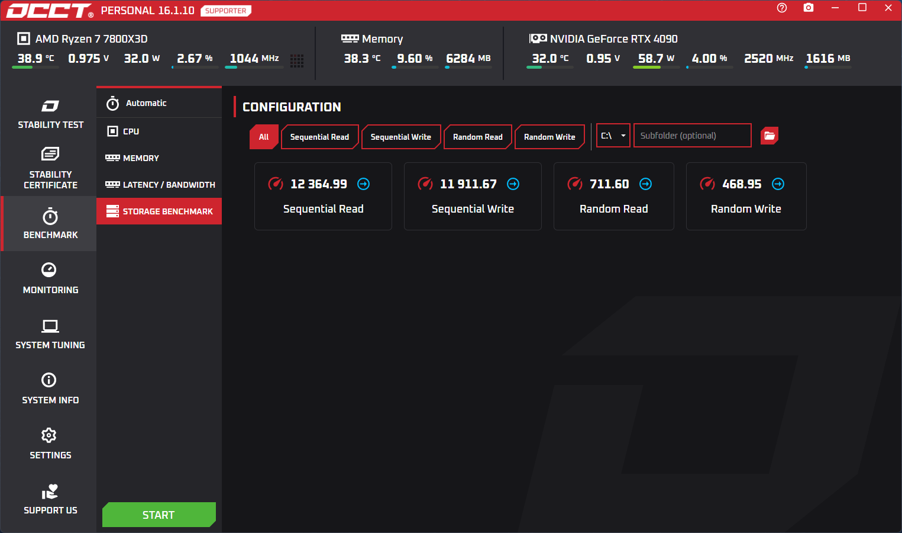

#### Benchmark Storage (SequentialRead)

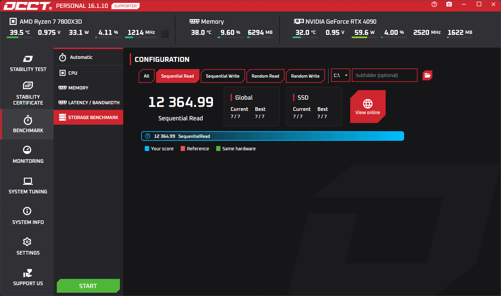

[Benchmark Storage (SequentialRead)](https://www.ocbase.com/benchmark/storage/6a25b30d2a6353361843eeb7)

#### Benchmark Storage (SequentialWrite)

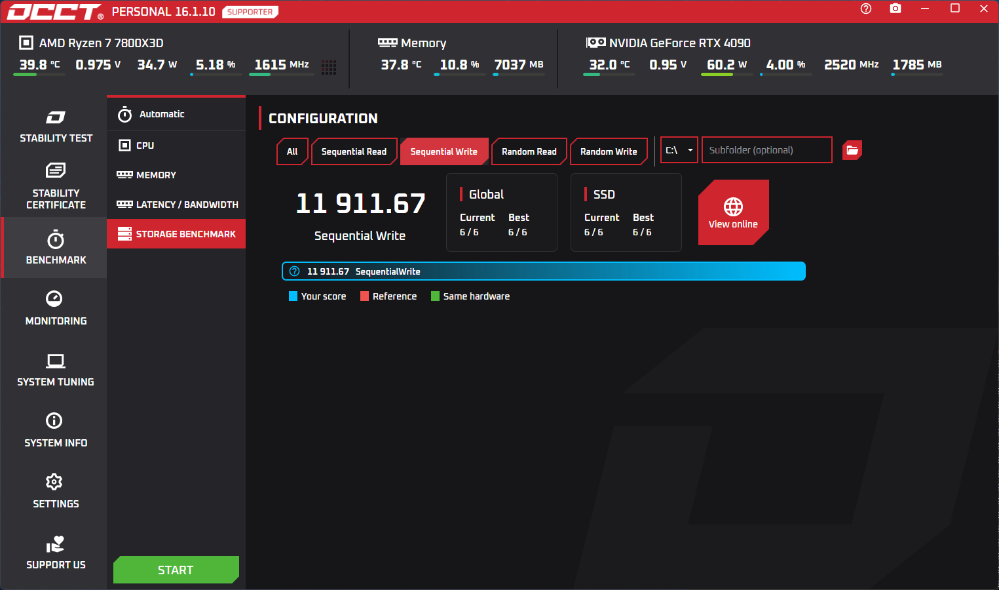

[Benchmark Storage (SequentialWrite)](https://www.ocbase.com/benchmark/storage/6a25b30d2a6353361843eeb8)

#### Benchmark Storage (RandomRead)

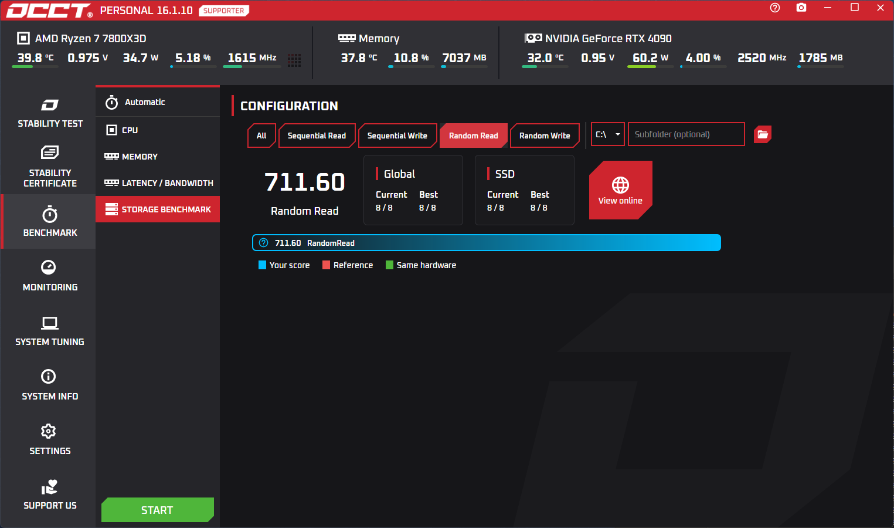

[Benchmark Storage (RandomRead)](https://www.ocbase.com/benchmark/storage/6a25b30d2a6353361843eeb9)

#### Benchmark Storage (RandomWrite)

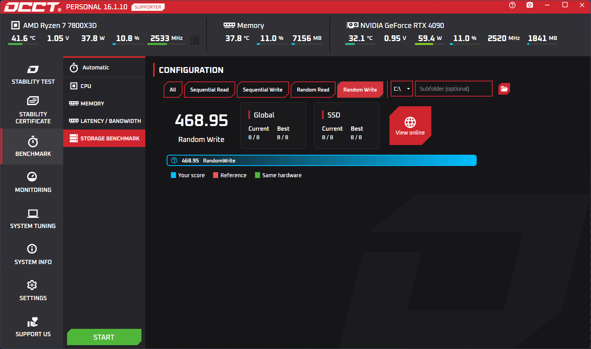

[Benchmark Storage (RandomWrite)](https://www.ocbase.com/benchmark/storage/6a25b30d2a6353361843eeba)
